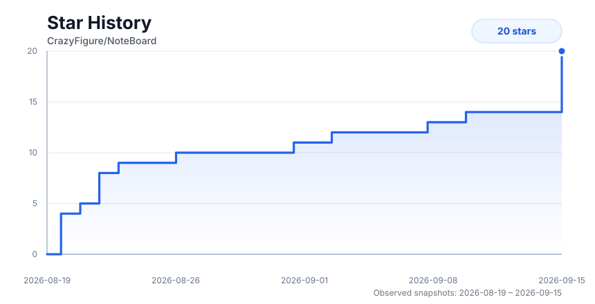

<div align="center">
  

  # NoteBoard

  **Windows 桌面笔记 + 画板软件**

  像记事本一样随手打开任意文本文件，像 Typora 一样写 Markdown，像白板一样画图。

  [](LICENSE)
  
  
</div>

---

## 这是什么

NoteBoard 是一个 Windows 桌面应用，把三件事合在一个窗口里：

1. **Markdown 笔记** — TipTap 所见即所得编辑，支持 KaTeX 公式、Mermaid 图表、GitHub Alerts、斜杠命令、块拖拽排序、大纲面板。
2. **代码/配置文件编辑** — `.txt` `.sql` `.json` `.yaml` `.yml` `.xml` 走 CodeMirror 6，有真正的按语言语法高亮、错误提示与代码折叠。
3. **自由画板** — Excalidraw 手绘风白板，原生 `.excalidraw` 格式。

它刻意不做的事：不做 AI、不做云同步、不做"工作区"这种强制概念。**你在资源管理器里双击一个文件，它就打开这个文件**，就这么简单。

## 核心特性

| 特性 | 说明 |
|---|---|
| **文件优先** | 双击即开、右键"用 NoteBoard 打开"、拖文件进窗口。没有导入，没有工作区绑定。 |
| **多窗口** | 像记事本一样开任意多个窗口。右键 tab → 在新窗口中打开。 |
| **目录随 tab 走** | 左侧资源管理器始终展示当前 tab 文件的父目录，切 tab 即切目录。 |
| **两侧可收起** | 编辑区左侧中间一枚悬浮箭头收起/展开目录；Markdown 文件右侧一枚箭头收起/展开大纲。 |
| **三套主题** | `晨光`（清白）、`琥珀`（暖象牙 + 陶土）、`墨夜`（深蓝），可跟随系统亮/暗。 |
| **代码块配色讲究** | 三套主题的代码块与行内代码都单独调过色，全部通过 WCAG AA 对比度实测。 |
| **排版可调** | 字体族、字号、行高、内容宽度四项独立可调。 |
| **保存分流** | Markdown 与画板自动保存；代码类文件手动 `Ctrl+S`，未保存有圆点提示与关闭拦截。 |
| **扛得住大文件** | 四层大文档优化：阈值回落、视口懒渲染、分段虚拟滚动、Worker 分段解析。 |

## 技术栈

Tauri v2 · React 19 · TypeScript · Vite · Tailwind CSS v4 · Zustand · TipTap 3 · CodeMirror 6 · Excalidraw · lowlight

## 快速开始

> 环境要求：Node.js ≥ 20、pnpm ≥ 9、Rust stable、Windows 10 1809+（含 WebView2 Runtime）

```bash
pnpm install
pnpm tauri dev        # 开发模式
pnpm tauri build      # 生产打包（NSIS 安装包）
```

## 开源协议与致谢

NoteBoard 采用 **GPL-3.0-only**。

本项目在设计与实现上参考了以下开源项目，在此致谢：

| 项目 | 协议 | 参考内容 |
|---|---|---|
| [excalidraw/excalidraw](https://github.com/excalidraw/excalidraw) | MIT | 画板引擎 |

第三方依赖与许可证详情请参阅 [THIRD-PARTY-NOTICES.md](THIRD-PARTY-NOTICES.md)。

## Star 走势

[](https://github.com/CrazyFigure/NoteBoard/stargazers)
