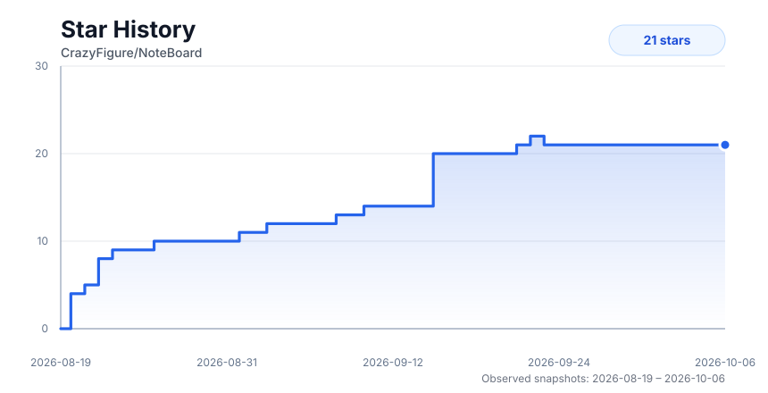

<div align="center">
  

  # NoteBoard

  **Windows / 安卓 笔记 + 画板 + 多维表格 + 知识工作台**

  像记事本一样随手打开任意文本文件，像 Typora 一样写 Markdown，像飞书一样整理多维表格，像白板一样画图，像 XMind 一样梳理脑图。

  [](LICENSE)
  
  
  [](https://github.com/CrazyFigure/NoteBoard/releases/latest)
</div>

---

## 概览

NoteBoard 是一款轻量、现代化的跨端效率工具，覆盖 **Windows 桌面** 与 **安卓手机**，集 Markdown 笔记、多维表格、声明式信息图、思维导图、白板绘图、代码配置编辑、文本对比与图片预览于一体。

坚持本地优先（Local-First）与文件优先理念：无强制工作区绑定、无强制云端同步。双击即开，即开即写，数据完全由你掌控。

## 下载安装

前往 [Releases](https://github.com/CrazyFigure/NoteBoard/releases/latest) 下载最新版本：

| 平台 | 安装包 | 说明 |
|---|---|---|
| **Windows** | `NoteBoard_x.y.z_windows_x64-setup.exe` | Windows 10 1809+，需 WebView2 Runtime（Win11 已内置）；支持应用内检查更新与自动重启。 |
| **安卓** | `NoteBoard_x.y.z_android_arm64.apk` | arm64 设备；新版本可在应用内检查并跳转浏览器下载 APK。 |

## 核心功能

- **Markdown 富文本与源码双模笔记**
  - 基于 TipTap 3 与 CodeMirror 6，所见即所得与源码编辑模式无缝切换。
  - 支持 KaTeX 科学公式、Mermaid 与 PlantUML 图表、Infographic 信息图嵌入、GitHub Alerts 提示块。
  - 斜杠命令快捷插入（`/`）、悬浮气泡工具栏、块级拖拽重排与文档大纲实时联动。
  - 表格多选单元格复制为 TSV、二维矩阵粘贴自动填充；查找替换支持首/末跳转与选区高亮。

- **多维表格（Bitable）**
  - 支持 `.bitable` 与 `.table` 文件，表格（Grid）、看板（Kanban）与甘特图（Gantt）视图自由切换。
  - 丰富字段类型：文本、多行文本（支持 Markdown 富文本编辑）、数字、单选、多选、日期、时间、日期时间、复选框等。
  - 自研日期时间选择器、多字段联合排序、按列分组展示与折叠、冻结列、记录详情抽屉侧边栏。
  - 类电子表格操作：矩形选区、填充柄自动填充、右键菜单批量操作，支持导出 CSV。
  - 甘特图视图：条形拖拽改期，周 / 月 / 季 / 年刻度切换，支持工作日模式。
  - 流畅拖拽体验：表头拖拽换列、行拖拽换序、看板泳道与卡片跨分组拖拽、视图 Tab 拖拽重排。

- **Infographic 现代化信息图**
  - 独立 `.infographic` / `.ig` 文件分屏实时预览编辑器，支持在 Markdown 笔记中直接嵌入。
  - 开箱即用预设模板：核心指标看板、项目里程碑时间线、业务流转步骤图、用户转化漏斗、方案对比表、四象限优先级矩阵与统计图表。
  - 声明式轻量配置，自动适配当前主题明暗风格。

- **思维导图与幕布大纲**
  - 支持 `.mindmap`、`.xmind`（XMind 格式兼容导入导出）与 `.mm`。
  - 脑图可视化与层级大纲双向实时同步。
  - 四种布局（向右逻辑图、向左逻辑图、双向平衡图、向下组织图）与 7 套配色主题，样式随文件持久化。
  - 支持整树拖拽与落位指示、节点图标选择器、备注说明与图片附件，`Tab` / `Enter` 快捷添加子节点与同级节点。

- **自由手绘白板与架构设计**
  - **Excalidraw 白板**：支持 `.excalidraw`、`.board`、`.canvas`，自由手绘涂鸦、流程草图与图形素材库。
  - **Draw.io 架构图**：集成 Draw.io 原生设计能力，支持 `.drawio` 与 `.dio` 专业架构图与系统流程设计。

- **代码与配置文本编辑**
  - 支持 `.txt`、`.sql`、`.json`、`.yaml`、`.yml`、`.xml`、`.log`、`.ini`、`.conf` 等格式。
  - 语法高亮、实时语法校验（Lint）、代码折叠与格式化。
  - Mermaid（`.mmd`）与 PlantUML（`.puml`）图表文件分屏实时预览。

- **双栏文本对比**
  - 左右双编辑器逐处差异高亮，支持合并采纳、左右互换、上下差异跳转与折叠相同行。
  - 中缝拖拽调整分栏宽度，双击一键居中复位。

- **图片查看与图表统一导出**
  - 图片查看器：支持 PNG、JPG、JPEG、WebP、SVG、GIF、AVIF、BMP、ICO 等格式直接预览与缩放。
  - 统一图表导出菜单：Mermaid、PlantUML 与 Infographic 均支持一键复制或导出为高清 SVG / PNG 图片。

## 桌面特性

| 特性 | 说明 |
|---|---|
| **文件优先** | 双击即开、右键“用 NoteBoard 打开”、文件拖拽入窗口直接查看或编辑。 |
| **多窗口与标签页** | 多窗口独立并行，标签页可自由拆分并在新窗口中打开，支持快捷切换。 |
| **智能目录联动** | 资源管理器动态跟随当前激活标签页所在目录，切换标签自动切换目录视图。 |
| **双侧灵活收起** | 编辑区左右两侧均配备悬浮折叠控件，一键展开或收起资源目录与文档大纲。 |
| **草稿与暂存** | 临时笔记快速记录，未命名草稿自动暂存，关闭与异常退出安全防丢。 |
| **收藏夹** | 常用文件一键收藏，支持自建分组文件夹归类，欢迎页直达。 |
| **精心调色主题** | 提供 `晨光`、`琥珀` 与 `墨夜` 三套主题，经过 WCAG AA 对比度优化，支持跟随系统明暗自动切换。 |
| **排版自由调节** | 字体族、字号、行高及内容最大宽度均支持个性化调整；提供可选免安装字体包（JetBrains Mono / Maple Mono）。 |
| **智能保存策略** | Markdown、画板、多维表格与思维导图支持自动保存；代码及配置文件支持手动保存与防丢拦截。 |
| **高性能大文档优化** | 具备分段虚拟滚动、视口懒渲染与 Worker 分段解析机制，平稳处理长篇文档与海量数据。 |
| **应用内更新** | 启动后检查新版本并展示更新日志，下载安装后自动重启。 |

## 安卓端特性

安卓版与桌面版共享同一套编辑器：Markdown、代码、画板、思维导图、多维表格、Draw.io、图表与信息图、文本对比均可在手机上使用。

| 特性 | 说明 |
|---|---|
| **移动端界面** | 首页“文件 / 收藏 / 已打开”分段，支持左右滑动切换；编辑页栈式导航，悬浮新建按钮、长按操作面板、底部格式栏。 |
| **本地存储** | 默认使用私有工作区“我的笔记”；授予所有文件访问权限后可浏览手机存储。 |
| **系统集成** | 支持文件导入、系统分享与“用其他应用打开”；返回键逐级返回，切到后台自动保存。 |
| **触控优化** | 思维导图双指缩放与单指平移；打开文档或选中表格单元格时不自动弹出软键盘。 |
| **主题适配** | 延续三套主题，系统栏颜色随主题同步，自动避让系统栏与键盘区域。 |

## 技术栈

Tauri v2（Windows / Android） · React 19 · TypeScript · Vite · Tailwind CSS v4 · Zustand · TipTap 3 · CodeMirror 6 · Excalidraw · Mermaid · KaTeX · @dnd-kit · @tanstack/react-virtual

## 快速开始

> 环境要求：Node.js ≥ 20、pnpm ≥ 9、Rust stable、Windows 10 1809+（含 WebView2 Runtime）

```bash
# 安装依赖
pnpm install

# 启动开发环境
pnpm tauri dev

# 构建生产安装包（NSIS）
pnpm tauri build
```

### 安卓版（arm64 APK）

安卓工程（`src-tauri/gen/android`）不入库，由 GitHub Actions 在发布时执行 `tauri android init` 生成，再经 `scripts/patch-android.mjs` 注入原生桥接（`src-tauri/android`）、存储权限、“用其他应用打开/分享到 NoteBoard”与签名配置。推送 `v*` 标签后，APK 会与 Windows 安装包上传到同一个 Release；手动触发工作流时可在 Actions 产物中下载。

正式签名需在仓库 **Settings → Secrets and variables → Actions** 中配置（未配置时使用 debug 签名，可安装但升级需卸载重装）：

| Secret | 说明 |
| --- | --- |
| `ANDROID_KEYSTORE_BASE64` | keystore 文件的 Base64 内容 |
| `ANDROID_KEYSTORE_PASSWORD` | keystore 密码 |
| `ANDROID_KEY_ALIAS` | 密钥别名 |
| `ANDROID_KEY_PASSWORD` | 密钥密码（留空时与 keystore 密码相同） |

```bash
# 生成 keystore（请妥善保管，丢失后无法以相同签名升级）
keytool -genkeypair -v -keystore noteboard.jks -keyalg RSA -keysize 2048 -validity 36500 -alias noteboard
# 转为 Base64 后粘贴到 ANDROID_KEYSTORE_BASE64
base64 -w 0 noteboard.jks        # Linux / Git Bash
# PowerShell: [Convert]::ToBase64String([IO.File]::ReadAllBytes("noteboard.jks"))
```

在浏览器中预览移动端界面（无需安卓环境，IPC 为内存模拟）：

```bash
TAURI_ENV_PLATFORM=android pnpm vite --port 1437
# 打开 http://127.0.0.1:1437/?mock=1 ，用浏览器开发者工具切换到手机尺寸
```

## 致谢

- 感谢 [Linux.do](https://linux.do) 社区对项目的推广与反馈。

## 开源协议

NoteBoard 遵循 **GPL-3.0-only** 开源许可协议。

## Star 走势

[](https://github.com/CrazyFigure/NoteBoard/stargazers)
