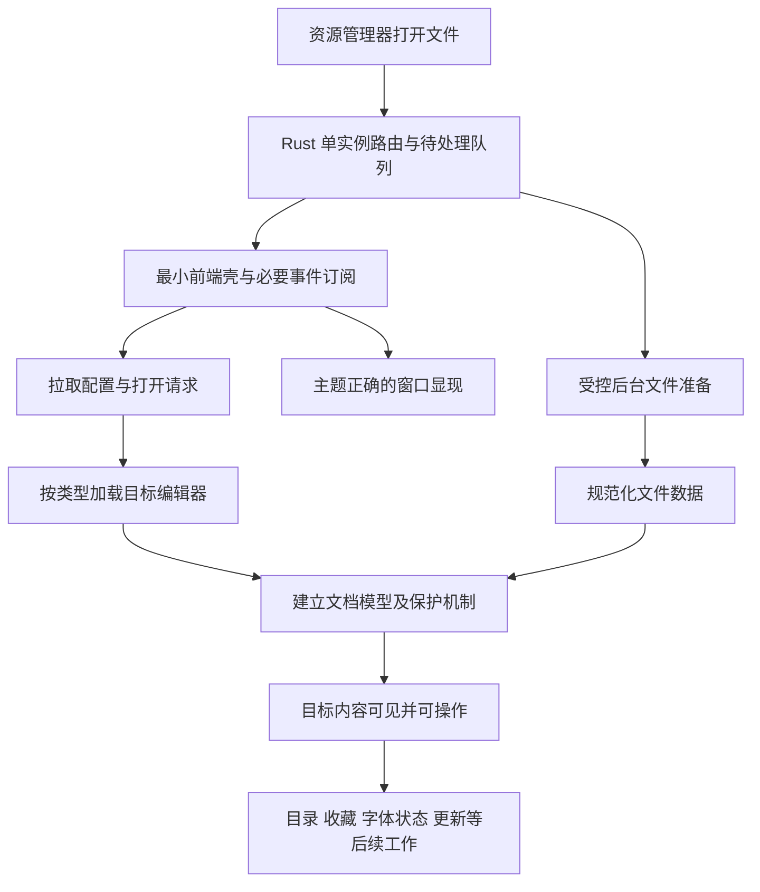

# NoteBoard 启动性能与低内存根治计划

日期：2026-09-05。代码基线：`dc032b1`，应用版本 `0.2.7`。工作区：`C:/Software/WorkSpace/NoteBoard`。

2026-09-05 第二轮细化：复核时 HEAD 为 `1e8d361`，相对上述基线只更新 Star 统计资产，本文涉及的业务代码未变。文末新增了“实施执行手册”，给出固定顺序、接口语义、失败处理和测试步骤。**接手模型先读执行手册，再按步骤查阅 P0–P7；执行手册中的明确约束优先于前文的概括性建议。只交接本文件即可，不依赖本次聊天记录。**

本文件是供后续 agent 实施的工程计划。本次只检查代码、已有构建产物及官方资料并编写计划，没有修改业务代码、运行安装版、测量实际启动时间或进行编译。“约 2 秒”为用户反馈，不能当作已采集的性能基线。代码中的既有文档引用不代表对应文档实际存在，实施时以本仓库代码与测试为准。

## 目标与结论

用户从桌面或资源管理器双击 Markdown 或其他已关联文件，应尽快看到目标内容并直接操作；连续输入、滚动、切换标签与窗口应流畅；使用过程中内存增长应有上限，全部现有功能、文件兼容性与数据保护行为必须保留。

目前可以确认存在应用层的结构性负担，不能直接把问题归咎于 Tauri：首屏依赖范围过大、字体初始化阻塞窗口就绪、文件打开流程串行等待、后台标签完整保活、编辑事务包含全文工作。优先在现有 Tauri + React 架构内修正这些根因，再用数据判断是否碰到 WebView2 冷启动下限。

WebView2 启动涉及浏览器引擎及其进程组，存在与机器、缓存状态有关的基础开销。即使前端优化到位，也不能承诺所有机器断电后的首次启动都达到原生轻量编辑器的速度；必须同时测量宿主下限与实际文件可操作时间。[Microsoft：WebView2 性能](https://learn.microsoft.com/en-us/microsoft-edge/webview2/concepts/performance)

默认方案关闭最后一个窗口后完全退出，不额外驻留托盘、隐藏 WebView 或开机预热进程。已有实例下复用现有窗口，真正退出后的再次打开仍按进程冷启动测量。性能收益不能通过缩短撤销历史、关闭保护、改变默认编辑模式或减少支持格式获得。

## 已有代码证据

下列为静态检查结论；行号对应上述基线，实施时按符号重新定位。耗时占比、内存占比均待实测。

| 发现 | 代码位置 | 影响与实施判断 |
| --- | --- | --- |
| 首屏壳静态导入全部编辑器与多种弹窗 | [AppShell.tsx:25](C:/Software/WorkSpace/NoteBoard/src/components/AppShell.tsx:25)、[App.tsx](C:/Software/WorkSpace/NoteBoard/src/App.tsx) | React 尚未选择文件类型，相关模块及其静态依赖已进入入口依赖图。应拆运行时边界，不能仅调整 chunk 名称。 |
| 保存与暂存链反向依赖具体编辑器组件 | [syncDocumentContent.ts](C:/Software/WorkSpace/NoteBoard/src/features/editor-code/orchestration/syncDocumentContent.ts)、[stagingManager.ts](C:/Software/WorkSpace/NoteBoard/src/features/staging/stagingManager.ts) | 只把 JSX 换成 `React.lazy` 仍可能由保存、快捷键、搜索等路径把编辑器拉回首屏。必须抽出独立能力注册表。 |
| 设置初始化等待字体包完成 | [settingsStore.ts:141](C:/Software/WorkSpace/NoteBoard/src/stores/settingsStore.ts:141)、[App.tsx:207](C:/Software/WorkSpace/NoteBoard/src/App.tsx:207) | `init()` 等设置及字体包；App 还以 `fontPackInitialized` 阻挡业务界面。字体状态影响窗口显现与首个编辑器挂载。 |
| 字体状态查询每次全量 SHA-256，随后主动加载所有字体 | [font_pack.rs:134](C:/Software/WorkSpace/NoteBoard/src-tauri/src/font_pack.rs:134)、[font_pack.rs:407](C:/Software/WorkSpace/NoteBoard/src-tauri/src/font_pack.rs:407)、[fontPack.ts:46](C:/Software/WorkSpace/NoteBoard/src/app/fontPack.ts:46) | 包内字体合计 36,441,444 字节，约 34.75 MiB；已安装时逐文件校验，再对所有 FontFace 调用 `load()`。包未安装时不能归因于这部分完整扫描。当前查询是同步 Rust command。 |
| 字体缺失提示还可能触发同步 PowerShell/WPF 枚举 | [sysfont/mod.rs:127](C:/Software/WorkSpace/NoteBoard/src-tauri/src/sysfont/mod.rs:127)、[App.tsx:157](C:/Software/WorkSpace/NoteBoard/src/App.tsx:157) | `list_system_fonts` 同步 command 中执行 PowerShell `.output()`，脚本加载 PresentationCore 并通过 Add-Type 编译 C#。发生在初始化完成后的提示检查，可争用首个编辑器初始化/输入；其实际耗时须单独测量，不能认为包没安装就没有字体相关成本。 |
| 窗口显示、消费打开意图与 ready 状态耦合 | [tauri.conf.json](C:/Software/WorkSpace/NoteBoard/src-tauri/tauri.conf.json)、[window/commands.rs:11](C:/Software/WorkSpace/NoteBoard/src-tauri/src/window/commands.rs:11)、[windowManager.ts:25](C:/Software/WorkSpace/NoteBoard/src/features/window/windowManager.ts:25) | 窗口初始隐藏；等待设置/字体后，先 `notifyWindowActive`，再 `windowReady`，后者同时显示窗口、标 ready、取意图，此时文件尚未读入。 |
| 打开事件订阅晚于初始文件处理/会话恢复 | [App.tsx:61](C:/Software/WorkSpace/NoteBoard/src/App.tsx:61)、[windowManager.ts:188](C:/Software/WorkSpace/NoteBoard/src/features/window/windowManager.ts:188)、[single_instance.rs](C:/Software/WorkSpace/NoteBoard/src-tauri/src/bootstrap/single_instance.rs) | 第二实例直接发事件，首实例未订阅时有丢失风险；`startEventListeners()` 本身也没有等待异步订阅全部完成。需可靠队列与握手，而非加延时。 |
| 文件打开有多次串行 IPC 与后续目录工作 | [openDocument.ts](C:/Software/WorkSpace/NoteBoard/src/features/editor-code/orchestration/openDocument.ts)、[fsio/commands.rs](C:/Software/WorkSpace/NoteBoard/src-tauri/src/fsio/commands.rs) | `probe → read → register → 建 Tab → readDir → pushRecent`。probe 读取最多 8 KiB，read 再读完整文件；不能描述成“全文读取两次”。目录读取在建 Tab 后，未必直接阻挡首次绘制，但会延后流程完成/监听注册并争用资源。 |
| 后台标签保存完整组件树 | [AppShell.tsx:562](C:/Software/WorkSpace/NoteBoard/src/components/AppShell.tsx:562) | 有活动标签时对所有 tabs 挂载编辑器；非活动项用 `top/left: -99999`、隐藏样式处理，实例、DOM、canvas、iframe、监听器并未释放。Home 分支则不挂载该编辑区，不能笼统认为任何时刻全部实例都在。 |
| Markdown 每次修改先做全文序列化 | [TipTapEditor.tsx:164](C:/Software/WorkSpace/NoteBoard/src/features/editor-md/TipTapEditor.tsx:164)、[documentHistory.ts:61](C:/Software/WorkSpace/NoteBoard/src/features/history/documentHistory.ts:61) | `serializeMarkdown`、完整基线换行规范化/比较、完整内容历史记录在 500ms 防抖之前执行；最多 201 个历史节点保存完整内容，需分析实际保留大小。 |
| 序列化还可能重新解析全文，初始化锁有固定 50ms 时间窗 | [serialize.ts:322](C:/Software/WorkSpace/NoteBoard/src/features/editor-md/serialize.ts:322)、[TipTapEditor.tsx:506](C:/Software/WorkSpace/NoteBoard/src/features/editor-md/TipTapEditor.tsx:506) | 冗余转义清理通过重新 parse 和文档比较验证，部分输入可能多次解析；原初始化以 setTimeout 解除锁。提前显示可编辑窗口后，真实输入可能落在仍忽略 onUpdate 的时间窗，必须改为事务来源识别。 |
| 全局订阅容易放大重渲染及后台工作 | [AppShell.tsx:109](C:/Software/WorkSpace/NoteBoard/src/components/AppShell.tsx:109)、[stagingManager.ts](C:/Software/WorkSpace/NoteBoard/src/features/staging/stagingManager.ts)、[useHeadings.ts](C:/Software/WorkSpace/NoteBoard/src/features/outline/useHeadings.ts) | 壳订阅整个 documents Map；暂存订阅整个文档/窗口 store；大纲 update 时遍历文档。需要按文档、版本和实际变化收窄。 |
| 视口调度器使用整个模块共享的单槽 | [viewportWorkScheduler.ts](C:/Software/WorkSpace/NoteBoard/src/features/editor-md/viewportWorkScheduler.ts) | 同一帧后来的任务直接覆盖前一个任务。如果是不同节点，不能视为同一工作的去重；根治时需要按任务身份保留，不能把少渲染/漏渲染当性能提升。 |
| 已有懒加载与大文档能力不能凭注释判断 | [BoardEditor.tsx](C:/Software/WorkSpace/NoteBoard/src/features/board/BoardEditor.tsx)、[lowlight.ts:109](C:/Software/WorkSpace/NoteBoard/src/features/editor-md/lowlight.ts:109)、[SectionedEditor.tsx](C:/Software/WorkSpace/NoteBoard/src/features/editor-md/SectionedEditor.tsx) | Excalidraw JS、Mermaid、KaTeX 已有动态 import；画板 CSS 仍静态引入。lowlight 文件最后立即调用 getter。SectionedEditor/sectionWorker 未发现实际入口引用，不能当作已上线优化；分段组件当前是 contentEditable 预览，且声明不支持跨段选择/拖块。 |

已有 `dist` 的时间为 **2026-08-31 11:10:52**，早于本次检查，不保证对应当前提交或用户安装版本。其 index HTML 显式预加载 highlight、Mermaid、Excalidraw；入口 JS 为 2,520,625 字节，Excalidraw chunk 为 1,149,321 字节，Mermaid chunk 为 667,966 字节，入口 CSS 为 210,852 字节。它证明该历史构建存在较重的入口依赖，不能据此得出当前启动的精确字节数或归因比例。

`manualChunks` 只规定拆包，不能保证按需执行；共同依赖和副作用也可能造成异步功能被预加载。应检查当前构建的模块归属、静态 imports 闭包、CSS 与实际资源请求，不以文件名或压缩后体积代替证据。[Vite 6：构建与异步加载](https://v6.vite.dev/guide/features#async-chunk-loading-optimization)

## 性能验收口径

### 分开测量这些场景

| 场景 | 定义 |
| --- | --- |
| 真正首次冷启动 | 系统重启后第一次打开；目标应用及其 WebView2 进程组不存在，记录其他软件是否已经使用 WebView2、文件缓存和字体包状态。清理用户缓存不作为默认测试步骤。 |
| 进程冷启动、磁盘缓存已热 | 完全退出 NoteBoard 后重开；OS 缓存允许保留，确认没有本应用残留进程。用户常说的“再次双击”通常包含此类。 |
| 已有实例打开新文件 | 首实例已可用，从资源管理器双击另一个文件；同类型编辑器已加载/尚未加载分别统计。 |
| 已有文件再次双击 | 当前窗口或另一窗口已打开同一文件，应定位并激活原文档，不重复读盘、挂载或覆盖脏数据。 |
| 多窗口与会话恢复 | 新建窗口、标签迁移、恢复多标签、恢复期间再次双击分别测量。普通空启动当前保持 Home，这一行为必须保留。 |

所有正式结论来自 **Release 安装后的 exe 与真实文件关联入口**。直接执行 exe 携带路径是诊断对照，Vite 浏览器、`tauri dev`、热更新结果不能替代验收。记事本也在同一台机器、同一文件和相同缓存条件下测量，记录其版本及是否保留后台状态，避免不对称比较。

### 时间点与初始预算

定义外部发起时刻 `T0`，记录以下里程碑。标记名是建议协议，实施前统一固定：

- `process_entry`：Rust 主入口最早可观测位置；它不包括 Windows 创建进程到 main 的全部耗时。
- `setup_start/end`、`webview_nav_start`、`js_entry`、`listeners_ready`、`shell_painted`。
- `intent_received`、`read_start/end`、`editor_import_start/end`、`editor_model_ready`、`document_painted`、`editor_interactive`、`enhancements_settled`。
- 单独记录字体哈希、字体激活、目录加载、会话恢复与初始化 IPC 的 spans。

`shell_painted` 是主题正确且窗口已实际可见的壳；`document_painted` 是目标内容可见；`editor_interactive` 是选定编辑模式能接收输入、保存/撤销保护已就绪，并能响应第一笔真实输入。React 挂载、`useEditor` 返回、`window.show()` 返回和一次 rAF 都不等于这三个条件。rAF/DOM 标记仅作代理，最终以外部录像/呈现事件与输入验证校准；隐藏窗口的绘制调度不能成为无限等待条件。

埋点位置也需要避免盲区：`main.tsx` 的函数体在静态依赖求值后才执行，里面的 `js_entry` 不能代表 JS 加载/解析的开始。用符合现有 CSP 的轻量 HTML 引导标记、资源时序与引擎 trace 覆盖此前开销；Tauri 自动创建配置窗口与 setup 钩子的实际顺序按锁定版本验证，不能将全部 WebView 创建时间错误记在 setup 内。外部录像记录帧率与计时误差，自动输入探针仅改隔离样本，不能修改用户原文或为了跑满 30 次反复抢用户窗口焦点。

以下是供实施追求的**工程目标**，不是已达成结果，也不是任意硬件保证。参考机优先用用户当前 Windows 机器，固定电源、缩放、刷新率、测试文件及后台负载；P0 记录后锁定预算，不能为了宣称达标悄悄放宽。

| 条件 | 目标 |
| --- | --- |
| 本地 SSD，小型普通 MD/TXT，进程冷启动但磁盘已热 | `T0 → shell_painted` p95 ≤ 300ms；`T0 → editor_interactive` p50 ≤ 500ms、p95 ≤ 800ms |
| 真正首次冷启动，同一小文件 | `T0 → editor_interactive` p95 争取 ≤ 1200ms，并给出相对最小 Tauri 对照的额外开销；超标须归因，不能归入“系统问题”就结束 |
| 已有实例，同类型小文件 | `T0 → editor_interactive` p95 ≤ 150ms；定位已打开文件 p95 ≤ 100ms |
| 近期标签切换 | p95 ≤ 100ms；被回收的小型编辑器恢复 p95 ≤ 200ms，同时保持光标、滚动和历史 |
| 输入响应 | 普通文档输入到下一次内容呈现 p95 ≤ 32ms、p99 ≤ 50ms；不要只测事件处理函数自身 |
| 连续滚动/拖拽 | 60Hz 参考环境争取帧间隔 p95 ≤ 20ms，无可重复的 >50ms 主线程长任务；高刷新率另按帧预算记录 |

小文件固定为 UTF-8 普通 MD/TXT 约 10 KiB 和 100 KiB、无网络资源，字符数也记录。图表密集 Markdown、首次加载画板/脑图/表格、长行、1–10 MiB 文本和现有大文档阈值上下的文件分档，不能把普通文本预算硬套给复杂渲染。复杂文件必须单报“目标内容可见/可编辑”和“首屏图表可操作/字体稳定”，不能用普通文本到位掩盖图表仍未工作。

测量要求：进程冷启动与已有实例场景各至少 30 次，报告 p50/p95、失败次数及原始数据；真正重启后的样本独立采集，先至少 5 次报告每次结果与范围，样本不足不得声称稳定 p95。慢样本和失败不得静默剔除。计时基于单调时钟，Rust Instant 与 JS performance.now 的原点不能直接相减；以外部测量为主，跨进程 spans 通过带 requestId 的握手校准并记录 IPC 误差。

### 内存与持续运行预算

统计 NoteBoard 主进程及归属其 UDF 的 WebView2 浏览器、renderer、GPU/utility 进程。不能只看 exe；也不能把其他应用的 WebView2 都算进来。分别报告 Private Bytes、Private Working Set、工作集、JS heap、DOM 数量和编辑器实例数；总工作集可能重复计算共享页，应明确计数方式。[Microsoft：WebView2 进程模型](https://learn.microsoft.com/en-us/microsoft-edge/webview2/concepts/process-model)

- P0 采集启动峰值、首次可编辑时、30 秒/5 分钟空闲、打开 20 个混合标签、关闭回到单标签后的数据。
- 初始优化目标：普通单 Markdown 场景进程组 Private Bytes 相比基线降低至少 30%；20 标签混合场景争取降低至少 50%。P0 若证明 WebView2 固定成本使总量比例不合理，报告空壳成本并另外锁定“应用增量”预算，不虚构统一的 30 MiB/50 MiB 绝对值。
- 编辑器缓存预算从“活动文档 + 最近使用的 1 个轻量编辑器”开始试验；重画板/iframe 单独按成本约束。使用估算成本及低预算回退，不依赖浏览器提供并不可靠的实时系统空闲内存值。
- 重复 30 轮“打开 → 编辑 → 保存 → 关闭”后，监听器、实例、Worker、Blob URL 等可枚举资源回到预期；已加载功能集合相同的情况下，空闲保留内存不应持续逐轮增长。以稳定平台值和堆快照归因，不要求 GC 在固定毫秒内回收全部 RSS。
- 缓存不得驱逐未同步的编辑内容、丢失既有 201 节点历史能力或改变保存策略。数据成本与可回收渲染成本分开记账。

## 目标架构与关键契约

### 启动关键链路



设置中影响编码、保存策略、首选模式的部分必须在文档可修改前确定；外观可先用现有缓存。启动不是把所有任务放进 `Promise.all`：CPU、磁盘和主线程都有限，应只让当前文件必需工作并行，非必要工作排队。

建议建立以下概念，具体命名可由实施者调整，但语义必须保持：

| 契约 | 责任与不变量 |
| --- | --- |
| `WindowBootState` | 区分 listeners-ready、shell-visible、document-ready、interactive、failed；不再让一个 ready 同时表示监听可用、可见、迁移成功。 |
| `OpenRequest` | 含 requestId、来源、顺序、目标窗口、路径；队列支持确认和重试。事件用于通知有待处理数据，Rust 队列作为窗口存活期间的权威来源。 |
| `EditorCapabilities` | 不静态依赖具体编辑器的运行时注册表；按 window/docKey/实例代际注册获取最新内容、保存前同步、选区、搜索、历史、挂起/恢复等能力。 |
| `DocumentSession` | 生命周期独立于 React 编辑器，保存内容版本、脏态、基线、历史、视图模式与定位状态；任何编辑器被回收前必须同步成功。 |
| `DeferredWorkQueue` | 区分输入保护、当前文件、首屏增强、后台维护优先级；有限并发，支持撤销、代际校验及去重，不用固定 sleep 伪造就绪。 |

命令、DTO 和状态迁移需前后端一起修改。若新增文件，放入现有 `src/core`、`src/app`、`src/features` 与 `src-tauri/src` 对应层；避免为了“架构化”大规模重写无关功能。

## 实施工作包

### P0：建立可重复基线与瓶颈证据

涉及：[main.rs](C:/Software/WorkSpace/NoteBoard/src-tauri/src/main.rs)、[lib.rs](C:/Software/WorkSpace/NoteBoard/src-tauri/src/lib.rs)、[main.tsx](C:/Software/WorkSpace/NoteBoard/src/main.tsx)、[App.tsx](C:/Software/WorkSpace/NoteBoard/src/App.tsx)、[vite.config.ts](C:/Software/WorkSpace/NoteBoard/vite.config.ts)、[scripts](C:/Software/WorkSpace/NoteBoard/scripts)。

1. 核对用户安装 exe 的路径、版本、构建配置、关联命令、UDF、字体包状态，区分 NSIS 安装器和真正运行的应用。只读检查关联注册表，尤其安装器生成项与 hooks 手写项；现有 hooks 已是 exe 直接接收 `%1`，没有证据说明默认经过慢速脚本启动器。
2. 在诊断构建加入上述 spans 与 requestId。标记输出批量写入、有上限，避免每事件同步落盘；关闭诊断时不增加热路径负担。记录文件大小/类型即可，不输出正文和完整私人路径。
3. 用 WPR/WPA、ETW 或等效工具区分进程创建、WebView2 初始化、文件 I/O、CPU/JS、布局和字体。DevTools 用于归因，正式时延另在无调试器附着条件下测量，避免测量工具改变结果。
4. 建立相同版本、配置、Release 优化和 UDF 条件下的最小 Tauri 对照页，仅显示轻量内容；按冷/热条件与真实应用对比。另做“系统字体/已安装字体包”“无恢复/恢复多标签”“仅当前编辑器/当前完整依赖图”的受控对照。
5. 对当前前端进行一次必要的生产构建，输出 manifest 或等价模块报告，递归统计入口静态闭包、按类型第一屏 JS/CSS 和最大同步执行任务。原有 `gate:budget` 指向的 `scripts/check-budget.mjs` 当前未找到，不能将空脚本/缺文件的命令视为已有性能门禁。
6. 记录结果到建议新文件 `C:/Software/WorkSpace/NoteBoard/docs/performance/启动基线.md`，原始数据放 `C:/Software/WorkSpace/NoteBoard/test-results/performance/`。安装测试构建使用隔离数据目录，不能覆盖用户正式笔记、会话和设置。

退出条件：明确约 2 秒中可观测各阶段的贡献、长尾原因、是否有安装/关联额外开销；确认最小宿主下限。即使尚不能复现，也须交付采样工具、环境记录和待用户现场采集的步骤，不能编造时延。

### P1：拆开启动握手，保证关联打开不丢、不重、不乱序

涉及：[bootstrap](C:/Software/WorkSpace/NoteBoard/src-tauri/src/bootstrap)、[window](C:/Software/WorkSpace/NoteBoard/src-tauri/src/window)、[state.rs](C:/Software/WorkSpace/NoteBoard/src-tauri/src/state.rs)、[windowManager.ts](C:/Software/WorkSpace/NoteBoard/src/features/window/windowManager.ts)、[IPC commands](C:/Software/WorkSpace/NoteBoard/src/core/ipc/commands.ts)、[IPC events](C:/Software/WorkSpace/NoteBoard/src/core/ipc/events.ts)。

1. 在核心前端初始化时先建立必要事件监听，返回可等待的 Promise；处理初始化重复调用、异步订阅尚未完成便卸载的清理问题。设置字体监听同样追踪 unlisten。保留开发 StrictMode，不能把关闭 StrictMode 当安装版优化。
2. 冷启动、第二实例、拖拽及新窗口打开统一进入可靠打开请求队列。新事件仅唤醒消费，消费者拉取队列并确认。对未 ready 窗口先排队；避免先清空队列后处理而使失败丢请求。以幂等处理实现最终只打开一个文档，不能承诺仅靠事件做到 exactly-once。
3. 使用同一套路径解析规则处理冷/热启动，包含空格、中文、大小写、相对路径与 cwd、`file://`、UNC、多参数；路径规范化可能访问文件系统，不在全局锁或 WM_COPYDATA 回调中做耗时工作。
4. 划分可见就绪和编辑就绪。主题缓存/基础布局可用后及时显示窗口，并在编辑区显示准确的目标文件加载状态；文件实际可操作另发里程碑。不要为了等待不可见窗口的 paint 而死等，也不要无条件 `visible: true` 引入白闪。
5. 保留源码中 Windows 消息线程限制：single-instance 回调立即转交工作线程；建 WebView 继续使用异步/工作线程合法路径，不把窗口操作塞回同步回调。插件保持第一位注册。[Tauri：单实例插件](https://v2.tauri.app/plugin/single-instance/)
6. 迁移的 `confirm_handoff` 必须确认文档已被目标窗口接纳并注册/同步成功，而非只检查通用 ready。源窗口在确认前持有内容；失败保留原标签，禁止迁移丢稿。
7. 初始化错误必须有可见、可关闭、可重试的错误界面；队列未就绪时的系统关闭也能安全处理。当前 `initializeWindow()` 缺整体异常兜底，补齐失败状态和窗口创建失败的记录回滚。

退出条件：在监听前/中/后注入第二实例、连续双击、混合多文件、慢盘、窗口正在关闭等条件下，请求最终正确处理；无重复注册、失焦、永久隐藏窗口或迁移丢内容。

### P2：真正按文件类型加载组件，切断反向依赖

涉及：[AppShell.tsx](C:/Software/WorkSpace/NoteBoard/src/components/AppShell.tsx)、[App.tsx](C:/Software/WorkSpace/NoteBoard/src/App.tsx)、[syncDocumentContent.ts](C:/Software/WorkSpace/NoteBoard/src/features/editor-code/orchestration/syncDocumentContent.ts)、[searchController.ts](C:/Software/WorkSpace/NoteBoard/src/features/search/searchController.ts)、[EditorToolbar.tsx](C:/Software/WorkSpace/NoteBoard/src/features/toolbar/EditorToolbar.tsx)、[TipTapEditor.tsx](C:/Software/WorkSpace/NoteBoard/src/features/editor-md/TipTapEditor.tsx)、[vite.config.ts](C:/Software/WorkSpace/NoteBoard/vite.config.ts)。

1. 先抽出轻量 `EditorCapabilities`，替换从 CodeEditor/TipTapEditor/BoardEditor 文件导入实例 getter 的模式。搜索、保存、暂存、快捷键、工具栏、状态栏全部查依赖图；类型依赖使用 `import type`，公共 barrel 不得再次 re-export 重组件。
2. 懒加载 Code、Markdown、Board、Image、Mindmap、Drawio、Bitable、Diagram、Infographic 编辑入口；解析打开路径后立即预取唯一目标入口，与读文件并行，避免“先读完再 import”的新瀑布。
3. Markdown visual/source 拆出各自运行时：遵循既有首选模式和大文档策略，默认 visual 不能临时切成源码冒充快开。普通文本不加载 TipTap，普通 Markdown 不主动加载画板/脑图/表格；无代码块时不初始化全部 lowlight 语言。
4. 保留 Markdown 全量 schema/解析与序列化规则，重图形渲染器和 NodeView 内部能力可延迟。不能简单删除不在首屏的扩展，否则加载再保存会丢失公式、图表或自定义节点。首次插入任意支持节点也必须正常。
5. 现有 Mermaid、KaTeX、Excalidraw 动态 import 应延续；查清构建预加载的真实回边和共同依赖。重功能 CSS 随对应入口加载；共享 CSS 留最小全局布局/主题。保留 Excalidraw 中文补丁、主题和导出资源，不能靠删除样式减少体积。
6. 设置、更新、字体提示、收藏管理等弹窗首次触发才装载；未打开时不要仅靠组件返回 null。安全关闭动作及未保存判断保持轻量常驻，弹窗模块未到位时保留关闭请求并给即时反馈，绝不能漏过保护。
7. 动态加载统一共享在途 Promise、失败清理及重试；模块失败只影响当前功能，保留文档和重试入口。不要使用带随机 query 的无限重试 import 生成不可回收模块。
8. 保留已存在的语言包按需加载；取消无意图的全编辑器空闲预热及 AppShell 的全局 Drawio prefetch。可在用户明确 hover/选择该类型时小范围预取，但必须取消过期任务并计入资源预算。
9. 构建检查递归入口闭包及模块归属：普通文本/普通 MD 的初始闭包中不得含 Excalidraw 核心、Drawio 页面、JSZip、其他无关编辑器运行时；Mermaid/KaTeX 仅在相应节点需要时进入。记录 raw/minified 字节、实际执行时间，gzip 仅作补充；不要关闭 modulepreload 掩盖静态依赖问题。

退出条件：在当前 Release 产物及运行资源轨迹里证实真正隔离，而不只是源码写了 `lazy`；各入口首次使用及加载失败恢复通过。

### P3：字体从启动全局门槛改为按需服务

涉及：[settingsStore.ts](C:/Software/WorkSpace/NoteBoard/src/stores/settingsStore.ts)、[fontPackStore.ts](C:/Software/WorkSpace/NoteBoard/src/stores/fontPackStore.ts)、[fontPack.ts](C:/Software/WorkSpace/NoteBoard/src/app/fontPack.ts)、[font_pack.rs](C:/Software/WorkSpace/NoteBoard/src-tauri/src/font_pack.rs)、[applyTheme.ts](C:/Software/WorkSpace/NoteBoard/src/core/theme/applyTheme.ts)。

1. 移除“所有字体包工作完成才能显示窗口/挂载 App”的全局依赖；设置读取与字体服务独立。缓存主题/排版继续在首屏应用，缓存过期、读取失败和 CSP 下都有正确兜底，不要在 main 的静态重依赖执行后才开始处理防闪烁。
2. 字体完整性保留。推荐先将完整验证移入受控 `spawn_blocking`，同进程多个窗口共享同版本验证 Promise/结果；更新、导入、删除及文件变化使缓存失效。跨进程不能只凭 mtime/size 或上次 ready 标记信任二进制；新启动需要的未验证字体先不用，校验完成再启用。不得为了速度去掉 SHA、原子安装或损坏修复能力。
3. 字体注册和加载分开：只对当前视图实际需要的族、字重、字形主动加载，其余按 CSS 使用触发。记录“包已验证”“字体已登记”“字体已可渲染”的区别，不能以全部 load 完成作为统一成功条件。
4. 未依赖字体包的窗口不加载约 35 MiB 的全部字体；已配置的字体继续可用，不静默改成系统字体配置。首次需要的已验证字体尽早加载；余下字重不要阻挡内容。
5. 处理字体替换造成的布局变化：保留滚动锚点、光标、选区，触发 CodeMirror/虚拟列表/画布必要重测；IME composition 或拖拽中不切换度量。临时 fallback 仅是加载阶段，设置值不变，并单报 `typography_settled`，不能把明显跳字形当“丝滑达标”。
6. 若实际配置字体导致首屏稳定性与预算冲突，优先研究缓存、合法字体压缩/子集和仅加载所需 face；不可缩减中文/Nerd Font 字形覆盖。任何字体包格式/清单变化带版本迁移与完整性测试。
7. 系统字体枚举改为进程内原生枚举，并从同步 command 移到有界工作线程；替换当前每次启动 PowerShell、WPF 和 Add-Type 的方式。先保持字体族名、去重、剔除纯符号族等现有行为，再共享进程缓存。提示用户下载/修复的能力保留，异常提示不抢走首次文件输入焦点。多窗口统一状态，异步旧校验不能覆盖新包状态。细节见执行手册 F 节。

退出条件：缺失/完整/损坏/被替换/系统已安装同名字体/多窗口/离线场景都可打开文件；全量字体校验不阻塞 UI 线程和窗口显示；用户配置生效且无输入错位。

### P4：压缩文件打开链路，避免重复 I/O 与目录争用

涉及：[openDocument.ts](C:/Software/WorkSpace/NoteBoard/src/features/editor-code/orchestration/openDocument.ts)、[fsio](C:/Software/WorkSpace/NoteBoard/src-tauri/src/fsio)、[registry](C:/Software/WorkSpace/NoteBoard/src-tauri/src/registry)、[path.rs](C:/Software/WorkSpace/NoteBoard/src-tauri/src/path.rs)、[closedWindowSession.ts](C:/Software/WorkSpace/NoteBoard/src/features/session/closedWindowSession.ts)。

1. 将本窗口已打开、在途打开的查询提前，查规范化 key 后直接激活；不能再次 upsert 覆盖脏内容。跨窗口先确认归属/预留，再做昂贵读盘；预留、读取失败回滚和最终注册要形成一致协议。
2. 为普通文件准备一个内部统一服务，复用 metadata、文件句柄和探测前缀，结果按目录/图片/文本/专有二进制/不支持分类返回。合并关键 IPC 可以减少往返，但不得把所有工作放进一个阻塞同步 command，也不得绕过原有编码、只读、体积确认和异常处理。
3. 同步文件读取、目录扫描、哈希等移出 UI 线程，使用异步 command 调用有界 blocking worker；仅把函数改为 async、内部仍直接同步扫描不是完整解决方案。全局 Mutex 仅保护短状态操作，不跨 await 或读盘持有。[Tauri：异步命令](https://v2.tauri.app/develop/calling-rust/#async-commands)
4. 图片继续用资源协议按路径解码，不把图片转完整文本/base64；XMind 等已有特殊解析保留二进制路径，不能把所有扩展统一塞进文本读取。未知类型继续按现有规则回退或提示。
5. 拿到目标文档数据立即建立模型；目录展开/定位、最近记录更新、收藏读取在可编辑后有序执行。目录 UI 可即时显示目标路径和加载状态，最终仍跟随当前标签。旧目录结果带 activeKey/requestId 校验，不能覆盖用户新切换目录。
6. `notifyWindowActive` 可并入一次握手的短状态更新；避免给冷启动增加必等的独立往返。后端先行读取仅服务确定的启动请求，结果一次消费/及时释放，不在 Rust 长期再存一份正文。
7. 大文件分档：小文件一次读取最简单；大文件受限读盘和解析，必要时分块传输/Worker。线程取消不了正在阻塞的系统 I/O 时，至少使结果失效并释放所有权，不能声称超时已取消底层读取。
8. 会话恢复先建立轻量标签描述与必要存在性检查，正文/编辑器按点击加载，保留当前 Home 首屏、标签顺序、原路径优先、缺失文件跳过、暂存引用、恢复布局等语义。接收到显式打开请求优先处理并阻止恢复任务回写 activeKey 抢焦点。
9. 延迟恢复过程中，不得在描述符/恢复状态未可靠接管前 `clearSession()`；明确崩溃/关闭时如何保留未加载标签与暂存信息，防止换速度丢会话。

退出条件：目录含上万项或网络/云盘目录较慢时，已读到的目标文档仍能先操作；重复打开只激活原文档；读入、编码、原子保存和恢复行为兼容。

### P5：把文档状态与编辑器实例分离，控制长期内存

涉及：[AppShell.tsx](C:/Software/WorkSpace/NoteBoard/src/components/AppShell.tsx)、[documentStore.ts](C:/Software/WorkSpace/NoteBoard/src/stores/documentStore.ts)、[windowStore.ts](C:/Software/WorkSpace/NoteBoard/src/stores/windowStore.ts)、[documentHistory.ts](C:/Software/WorkSpace/NoteBoard/src/features/history/documentHistory.ts) 及全部编辑器适配层。

1. 先完成 P2 能力注册表及 DocumentSession 契约，再修改当前所有标签挂载逻辑。活动标签挂载，近期轻量实例有界保活，其余只保留可恢复状态；不要只换成 `display:none`，那不会释放实例。
2. 在切走/回收前同步权威内容，提交版本与脏态，保存选区、滚动、模式、搜索位置、画布视口/缩放、表格视图/筛选/选中状态、脑图折叠与选区、Drawio 状态等。IME、拖拽、保存、迁移进行中临时禁止驱逐；同步失败保留实例并报告，不继续销毁。
3. 文档历史属于 DocumentSession。保留现有 201 节点上限及跨模式撤销语义，研究增量补丁 + 周期检查点/结构共享，避免每节点完整复制全文；二进制资源按 ID 引用。不能通过减少节点或清空后台历史达到预算。
4. 对不易恢复的编辑器先做独立验证：Drawio 需等内容导出/确认，Excalidraw 保留场景与恢复所需 appState，Bitable 保留视图状态；没证明可恢复前，不一刀切卸载。
5. 已命名干净文档可回收解析模型，重新激活时重新核对磁盘版本；有历史或未保存内容时保留可靠的数据表示。不得把磁盘文件当作未保存编辑的替代品。
6. 统一 dispose：清理能力注册、history adapter、搜索引用、autosave 定时器、observer、DOM 监听、Worker、canvas/图片缓存、Blob URL、iframe 与渲染队列。用实例代际防止旧实例清理函数误注销刚重建实例。
7. 收窄 Zustand selector：壳只订阅标签结构和必要元信息，编辑器按 docKey 订阅。避免每次内容/脏态更新重渲染所有标签和弹窗；重组件必要处 memo，但不用 memo 掩盖副作用和全局订阅。
8. 缓存按对象估算字节与数量双重约束。模块动态 import 后通常留在该 WebView 的模块缓存，卸载 React 组件不等于卸载 JS 引擎代码；内存报告区分模块基线、实例状态和泄漏，不通过周期刷新整个 WebView回收数据。

退出条件：20 标签混合文件验证预算；30 轮打开关闭后资源数量无累积；跨标签和跨模式历史、即时保存、关闭保护、崩溃暂存与恢复无回归。

### P6：去掉输入热路径中的全文工作，完成运行时流畅性

涉及：[TipTapEditor.tsx](C:/Software/WorkSpace/NoteBoard/src/features/editor-md/TipTapEditor.tsx)、[serialize.ts](C:/Software/WorkSpace/NoteBoard/src/features/editor-md/serialize.ts)、[documentHistory.ts](C:/Software/WorkSpace/NoteBoard/src/features/history/documentHistory.ts)、[stagingManager.ts](C:/Software/WorkSpace/NoteBoard/src/features/staging/stagingManager.ts)、[useHeadings.ts](C:/Software/WorkSpace/NoteBoard/src/features/outline/useHeadings.ts)、[viewportWorkScheduler.ts](C:/Software/WorkSpace/NoteBoard/src/features/editor-md/viewportWorkScheduler.ts)。

1. 以 Profile 验证每键全文序列化、基线比较、历史分组、大纲遍历的成本。首先保留事务/版本和最小编辑信息；延后序列化并按 docKey+revision 合并任务，不在 onUpdate 先算完全文再防抖。
2. 保存、暂存、切模式、回收、窗口迁移、关闭构成强一致屏障：必须获取当前权威 revision 对应的内容。旧异步序列化不得覆盖新版本；保存途中继续输入时，磁盘成功只确认实际写入 revision，新编辑仍应为脏。
3. 撤销/重做及回到已保存内容时的“变干净”语义不能变；增量历史方案需保留准确分组与跨模式映射。不可仅延迟全文快照而漏掉原本可撤销的步骤，也不能为快速脏态判断用简单 `version != savedVersion` 永久误标回退后的内容。
4. 普通文档优先单编辑器增量更新，Worker 用于可隔离的纯解析/高亮，不传 DOM 或 ProseMirror 实例。只有确认收益时采用 Worker，并评估结构化克隆及 AST 回传的峰值内存；DOM-heavy 图形渲染不能假设直接塞进 Worker。
5. 大纲只对影响标题的变更增量更新/有界合并，选区移动不重扫全文；高亮、图表渲染沿用视口门控并加入活动标签状态，后台文档不抢渲染队列。缓存按字节设限，陈旧任务可取消/忽略且释放引用。
6. 当前 SectionedEditor/Worker 未接入主链，且分段实现缺少跨段编辑能力。此次不能直接启用它作为性能捷径。先保留现有大文档源码策略；只有完整跨段选择、搜索替换、拖块、撤销、序列化和保存证明等价后，才把完整分段方案纳入发布。
7. 暂存从“任意 store 变化扫描全部文档”改为 dirty revision 队列；保护订阅必须在首次编辑前建立，磁盘写入可合并但保持原有防丢时限。升级检查、字体扫描、历史列表与目录维护不抢前几帧；多窗口后台任务去重，保留用户手动触发立即执行的能力。
8. 不使用无限制 idle 预热，也不把保存依赖仅挂在可能一直不运行的 requestIdleCallback；后台有截止时间、交互让路和降级调度。所有新交互保持 Hover/Active，自定义 Tooltip 延迟 100ms；设置预览可即时生效、取消恢复。

退出条件：连续中文输入、长按按键、粘贴、滚动、图表拖拽和保存并发实测通过响应预算，数据一致性测试通过。改善首屏后首次点击不应再出现“补加载卡死”。

### P7：Release 收尾与框架下限决策

依赖 P0–P6 的实际测量结果。涉及：[Cargo.toml](C:/Software/WorkSpace/NoteBoard/src-tauri/Cargo.toml)、[tauri.conf.json](C:/Software/WorkSpace/NoteBoard/src-tauri/tauri.conf.json)、[window/manager.rs](C:/Software/WorkSpace/NoteBoard/src-tauri/src/window/manager.rs)、[NSIS hooks](C:/Software/WorkSpace/NoteBoard/src-tauri/resources/nsis/hooks.nsh)。

1. 检查真实安装版使用 Release、正确资源与锁文件；按 P0 证据评估 LTO/codegen-units/体积优化等候选，逐项 A/B。`opt-level=z`、压缩 exe 和减少文件尺寸不保证执行更快，不直接套“极致优化”配置。
2. 主进程初始化保持短小，验证窗口状态插件是否影响初始 hidden/visible 流程。发布调试能力按当前产品要求处理；不能把 `devtools: true` 本身等同于启动时自动打开 DevTools 或认定它就是 2 秒来源。
3. 检查 UDF 是否稳定且位于本地磁盘、是否重复建环境；同应用窗口可核验环境/参数复用，不能随意共享其他应用/开发版的数据目录。不要每次清理缓存、每标签建 WebView、禁用 GPU 或刷新整个 WebView 获得表面内存下降。
4. 最小宿主仍占大头时，交付三组证据：最小 Tauri、优化后的普通文件、同机记事本。列出剩余毫秒在哪一段，不再继续无依据地改前端。
5. 若无常驻条件下仍无法满足预算，输出下一步架构决策：保留当前富编辑功能与测得的冷启动下限；或者另行设计原生编辑宿主/更深层渲染架构迁移。原生方案需证明全部行为兼容，原生空壳/启动动画只能改善可见时间，不能计入正文可编辑达标。
6. 预热隐藏 WebView 会用常驻内存换热启动，和默认低内存完全退出目标存在取舍；不在本计划中偷偷启用。若未来单独提供可选快速启动，应明确常驻内存和退出语义，并继续公布真正冷启动数据。

退出条件：安装版验证通过，剩余性能限制有证据；未达预算时明确标注“部分完成/平台下限待架构决策”，不能只因比以前快就宣布全部达成。

## 执行顺序与交接

P0–P7 是工作主题划分，具体落地顺序以执行手册的 S00–S15 为准：先测量并修正契约，再拆加载、字体和打开链路，之后处理回收与输入热路径。P2 的能力注册表、P4 的打开协议和 P5 的文档生命周期是 P6 正确同步的基础，应先固定契约再深化性能优化。

若用户之后安排多个 agent：P0 由一个性能负责人维护统一基线；P1/P4 归一个文件与窗口负责人；P2 归前端加载负责人；P3 可独立处理字体服务；P5/P6 共享 DocumentSession/历史接口后实施。每个公共文件明确一个修改负责人，避免多个 agent 同时重写 AppShell、windowManager、documentStore 和 IPC DTO。这里是后续任务划分建议，本次没有启动其他 agent。

每个工作包交付：代码改动、关键中文前置注释、对应不变量测试、前后测量、失败/取消/重试处理和资源释放说明。沿用已有文件与注释，新增模块仅为清晰依赖边界。禁止擅自 `git commit`、`git push`；需要时按用户要求另行询问。

## 回归与发布验收清单

### 保留全部功能的验证矩阵

以下每项至少覆盖“首次按需加载 → 编辑/操作 → 切走再回来 → 保存/关闭 → 重新打开”。支持范围以当前可运行基线、类型映射与测试共同确定，README 声明与实现差异单独记录，不能在优化时悄悄删除入口。

| 范围 | 必查内容 |
| --- | --- |
| Markdown | visual/source 首选模式、往返格式保持、跨模式撤销/重做、表格/剪贴板、任务列表、Alerts、链接弹窗/本地链接、图片粘贴、斜杠命令、气泡菜单、块拖拽、大纲、查找替换 |
| 嵌入图形 | Mermaid、KaTeX、PlantUML、Infographic 首次出现/插入、滚出视口再返回、主题切换、错误源码可恢复、SVG/PNG 导出；保留现有渲染安全选项 |
| 代码/文本 | 所有关联文本类型、未知文本回退、语法包、折叠、格式化、Lint、JSON 操作、软换行、长行、中文 IME、选区与滚动恢复 |
| Excalidraw | 三种画板扩展、场景/素材/图片、连接/流程图、中文、主题、画布视口、演示模式、撤销、导出、自动/手动保存 |
| 脑图 | mindmap/xmind/mm 导入导出、大纲双向编辑、折叠、拖拽、图标、备注、附件、历史与视口 |
| Drawio | drawio/dio 首次加载、iframe 通信、内容导出确认、编辑保存、切换/回收恢复、网络失败与重试；远程资源耗时单独报，不影响其他本地格式 |
| Bitable | 表格/看板、字段类型、长文本 Markdown、记录详情、筛选排序分组、日期时间、自动填充、行列/卡片拖拽及所有视图状态 |
| 独立图表/图片 | Mermaid/PlantUML/Infographic 独立编辑预览、导出；全部当前可显示图片格式、GIF 动画、缩放、Blob/纹理清理 |
| 桌面与设置 | 单实例、多窗口、最小化恢复、聚焦已打开文件、迁移、拖拽、目录跟随、收藏、三主题、跟随系统、字体包下载/导入/修复/移除、多窗口同步、更新入口、排版即时预览与取消 |
| 文件安全 | 自动/手动保存、UTF-8/BOM/GBK、CRLF/LF、只读、外部改动/删除/重命名、另存为、未保存关闭确认、取消、不保存、暂存、恢复 Home、原路径优先、缺失跳过、进程异常结束后的恢复 |

### 新增的必要自动测试

- 打开协议：订阅前到达、订阅竞态、确认重试、同文件并发、读失败回滚、窗口销毁、连续多文件和迁移未接纳失败；测状态，不依赖固定 sleep。
- 动态加载：首次打开各类型、保存/搜索/快捷键不穿透加载边界、模块失败重试、卸载后异步返回、无关库不在普通文件入口静态闭包。
- 字体：完整性保留、重复初始化去重、包变更使旧结果失效、只加载实际 face、fallback 恢复不改配置、不破坏 IME/选区。
- 生命周期：未保存立即切走/回收、恢复历史与视图、保存中继续输入、旧实例注销新实例防护、资源计数回归、不同类型缓存驱逐。
- 历史与序列化：沿用现有 Markdown roundtrip fixtures，覆盖跨模式 201 节点、回到基线脏态清除、版本乱序与关闭前强制同步。

使用已有 `pnpm test:unit` 和相关 Rust 测试；每个工作包运行对应子集，修改公共状态/IPC 时再扩到相关集合。不要因为只是文档修改跑编译。落地后最终至少完成类型检查、相关 lint、全量现有单元/Rust 测试及一次必要的生产安装包验证。`test:contract` 当前引用的目录未在文件清单中发现，需建立实际测试或调整门禁，不能以空测试通过当保证。

建立 `C:/Software/WorkSpace/NoteBoard/scripts/check-budget.mjs` 或明确替代现有 package 脚本的实现：检查入口静态闭包、按场景资源预算、实例数和稳定性能基线。只降低 bundle warning 阈值、截图 loading 或在不稳定 CI 上测绝对毫秒都不是有效门禁；绝对时延在固定参考机跑，CI 守依赖边界及功能不变量。

交付建议文件：

- `C:/Software/WorkSpace/NoteBoard/docs/performance/启动基线.md`：环境、旧版各指标、对照结果与原始数据位置。
- `C:/Software/WorkSpace/NoteBoard/docs/performance/优化验收.md`：新版同口径对比、功能矩阵、内存曲线、未解决限制。
- `C:/Software/WorkSpace/NoteBoard/docs/performance/架构决策.md`：仅在框架下限阻止目标时写，列出可验证的下一步及取舍。

最终只有在“关联入口实际达标、输入流畅、内存受控、功能/数据无回归”同时成立时才能勾选完成。所有为开发/测试启动的新进程在交付前停止，尤其 Vite、Tauri 测试窗口和采样辅助进程；只终止本任务启动的进程，不影响用户已有软件或未保存文档。

## 实施执行手册

### A. 接手规则与固定步骤

这是对前文的实施约束，不是额外一套架构。除明确写“待验证后启用”的部分外，按下面默认方案做，不同时尝试多套状态管理/编辑器方案。不升级整个依赖栈、不替换 Tauri/React、不重写全部 AppShell、不新增持久后台服务。

先创建实施进度文件 `C:/Software/WorkSpace/NoteBoard/docs/performance/实施进度.md`，每步记录 `未开始 / 进行中 / 功能通过待性能验证 / 通过 / 受阻`、修改文件、已运行命令、结果和下一动作。断开后从该文件续做；不能把未完成步骤打勾。基线数据和实施记录是实施者后续产物，本次尚未生成。

| 顺序 | 要做的具体动作 | 完成判定；未通过时的处理 |
| --- | --- | --- |
| S00 | 记录 HEAD、已暂存/未暂存改动、工具版本、锁文件和现有应用进程；验证数据隔离，建立测试资料目录 | 不改用户暂存区。无法证明隔离时，只做静态/纯单元工作，不启动会写正式数据的测试应用。 |
| S01 | 完成 P0 埋点、最小宿主对照、当前生产资源图和基线采样 | 保留原始记录。环境暂时无法做真实桌面采样时，标记待验证，可继续已证实的结构改造，但不得宣布性能达标。 |
| S02 | 按 B 节修正归属查询类型、所有权注销保护、CodeMirror 按 key 查询；记录迁移安全缺口 | 契约、跨窗口隔离、两个代码标签保存测试通过。此步保持编辑器挂载策略与序列化算法不变。 |
| S03 | 按 D 节新增轻量能力注册表，替换所有组件 getter 调用；补充统一异步 flush 契约 | 打开/保存/暂存/搜索/工具栏行为不变；旧 getter 跨模块运行时引用归零。禁止此时回收实例。 |
| S04 | 按 C 节实现队列、握手拆分和可靠迁移；前后端 DTO 同步落地 | 乱序/重入/重试/关闭/迁移测试通过，再删除旧事件直接打开逻辑。不能新旧消费者并存。 |
| S05 | 按 E 节逐类型 lazy，先隔离 Board/Drawio/Mindmap/Bitable/Image，再独立图表和弹窗 | 当前构建依赖报告和首次功能 smoke 通过；不切换文档状态表示，不改变后台标签数量。 |
| S06 | 按 F 节解除字体门槛、移出同步 SHA、原生字体枚举、按 face 加载 | 三种包状态可启动、没有正常路径 PowerShell 字体子进程、无输入/度量错位。保留全部字形与修复功能。 |
| S07 | 按 G 节实现文件准备/所有权预留、目录及最近记录延后 | 重复打开不读正文；失败无幽灵所有权；慢目录不挡编辑。 |
| S08 | 拆 Markdown visual/source 运行时，模式选择先于内核创建；去掉初始化 50ms 忽略真实输入的窗口 | 默认模式、大文档模式、切换往返、显示即输入测试通过；源码首屏不创建隐藏 TipTap 实例。 |
| S09 | 按 H 节给 DocumentSession 增加版本及同步屏障，迁移保存/暂存/另存为/切模式调用 | 写入期间继续输入、关闭前最新内容、旧回调失效测试通过；此步不改变历史存储格式。 |
| S10 | 会话恢复改为轻量描述符，按需加载正文，保存恢复事务 | Home 不创建编辑器，点击才加载；恢复途中退出/显式打开不丢会话、不抢焦点。 |
| S11 | 按 I 节先为 Code/Image 验证状态捕获和回收，再启用小型缓存 | 当前文档+最近轻量实例策略可用，输入/光标/滚动/历史保持；不能以此宣布其它类型内存完成。 |
| S12 | 逐个接入 Markdown、图表、脑图、表格、画板、Drawio 生命周期 | 每个类型先测完整恢复再允许驱逐；不支持项保留实例并在进度中列未完成，继续修适配层。 |
| S13 | 按 J 节先做历史存储压缩，再做不可变快照与输入路径移除全文工作 | 两小步分别通过 201 节点及 roundtrip 测试；没有等价序列化就不启用新历史方案，继续修复而非丢功能。 |
| S14 | 按 K 节收窄订阅、dirty revision 暂存队列、渲染队列和资源释放 | 空闲资源与 30 轮循环无累积；连续输入暂存时限没有退化。 |
| S15 | 按 L 节跑完整回归和固定机器 Release 验收，必要时进入 P7 下限决策 | 同时满足性能和行为要求；否则列出未通过指标与证据，不写“全部完成”。 |

只需为当前步骤添加必要模块。不要在 S03 一次创建未来所有类、状态机和占位实现。每步先通过再继续，不在失败后加 `catch(() => {})`、关 lint/test、强制类型断言或扩大延时使测试变绿。无关既有失败单列，相关正确性失败必须先修；需要撤回时只撤本步骤可确认的改动，不用 `git reset --hard` 或覆盖他人工作。

### B. 先修正会放大风险的已有契约

以下是第二次复查新增的代码事实，并非推测的耗时来源：

| 位置 | 当前问题 | 固定处理 |
| --- | --- | --- |
| [commands.ts:82](C:/Software/WorkSpace/NoteBoard/src/core/ipc/commands.ts:82) 与 [registry/commands.rs](C:/Software/WorkSpace/NoteBoard/src-tauri/src/registry/commands.rs) 的 `findDocumentOwner/find_document_owner` | 前端写 `Promise<{ownerLabel: string \| null}>`，Rust 返回 `Option<String>` | 统一为现有真实 wire 格式 `string \| null`，前端类型和所有调用/模拟一并修正。不要只改断言。 |
| [registry/documents.rs](C:/Software/WorkSpace/NoteBoard/src-tauri/src/registry/documents.rs) 的 `unregister` | 忽略 `_label`，任何窗口可移除某 key 的所有权 | 当前所有者与调用者一致才允许移除；后续有 reservation/generation 时还需匹配对应代际。旧窗口迟到清理不能注销新所有者。 |
| [CodeEditor.tsx:48](C:/Software/WorkSpace/NoteBoard/src/features/editor-code/CodeEditor.tsx:48) | 全局单个 `editorView` 与壳多标签挂载矛盾；卸载直接置 null | 先变成按 docKey + instanceId 注册，通过活动 key 查当前实例，实例匹配才删除；随后并入能力注册表，不保留两套长期权威表。 |
| [windowManager.ts:305](C:/Software/WorkSpace/NoteBoard/src/features/window/windowManager.ts:305) | 迁移直接读滞后镜像，viewState 用空值；目标 adopt 强制 utf8/lf、未恢复完整元信息 | 先 flush 权威快照，再携带原 metadata、历史和类型视图状态；使用 C 节事务确认，不依赖 show/ready。 |
| [fsio/commands.rs](C:/Software/WorkSpace/NoteBoard/src-tauri/src/fsio/commands.rs) 的 watcher 命令 | `watch_dir/unwatch_dir` 当前是占位；命令参数与前端传参也不完全一致 | 记录当前实测行为，不能写“已去重/已释放 watcher”却只改空函数。S14 在真实 plugin-fs watcher 或补全的 Rust watcher 上验证引用计数与清理。 |

新增跨窗口命令用实际调用 WebView 的身份定位窗口，不把前端可填写的 label 当成已验证身份；普通正文只通过对应窗口 IPC 返回，禁止全局广播正文。`register/unregister/reconcile/transfer` 共享同一所有权模型，不能四处各补一个 Map 来掩盖冲突。

### C. 打开队列、窗口显示和迁移的明确协议

**默认实现位置。** 扩展现有 [window/intent.rs](C:/Software/WorkSpace/NoteBoard/src-tauri/src/window/intent.rs) 管理打开请求，不引入数据库/消息中间件。业务处理留在 [windowManager.ts](C:/Software/WorkSpace/NoteBoard/src/features/window/windowManager.ts)；可新增 `C:/Software/WorkSpace/NoteBoard/src/app/bootCoordinator.ts` 管理启动与单个 drain。DTO 同时修改现有 Rust/TS 文件。

**建议 wire 类型（需要实现，当前不存在）。** ID 用字符串，避免 Rust u64 超出 JS 精度；序号用本次进程内受限整数并做溢出处理。字段 camelCase、枚举 kebab-case，与现有约定一致。

```ts
/** 每个文件一个请求；同批路径按输入顺序分配 sequence。 */
interface OpenRequestDto {
  requestId: string;
  batchId: string;
  sequence: number;
  source: 'cli' | 'second-instance' | 'drop' | 'dialog' | 'restore';
  path: string;
  cwd: string | null;
}

/** 握手不读正文、不验证全字体、不消费请求，也不确认文档迁移。 */
interface WindowBootDto {
  protocolVersion: 1;
  consumerId: string;
  startupMode: 'empty' | 'explicit-open' | 'handoff';
  transferId: string | null;
  queueVersion: number;
}

/** 业务处理已经有明确结果才确认；failed 必须已有用户可见错误与重试入口。 */
type OpenOutcome = 'opened' | 'focused' | 'cancelled' | 'failed';
```

| 新命令/事件语义 | 规定 |
| --- | --- |
| `window_listeners_ready` → `WindowBootDto` | 前端已成功订阅必要事件再调用。为当前消费者分配代际；旧 consumer 后续结果不可提交。首次启动来源在后端记录，队列暂空不等于普通空启动。 |
| `list_open_requests(consumerId)` | 非破坏读取本窗口未确认请求及 queueVersion；默认批量上限 32，处理完继续拉取。这里不返回正文。 |
| `ack_open_request(consumerId, requestId, outcome)` | 幂等确认并从 pending 移除；拒绝旧 consumer 和非所属窗口确认；无效 ID 不修改别的请求。 |
| `nb://open-requests-available` | 定向窗口的唤醒事件，只携带队列版本。不能在事件监听里再走一套直接 `openDocument(path)`。 |
| `window_shell_ready` | 只负责基础 DOM/主题已应用后的窗口 show/focus；不阻塞等待隐藏窗口 rAF。后续实测 `shell_painted`，两者不等价。 |
| `editor_interactive` | 在目标实例可输入、模型与保护就绪后记录里程碑；不承担删除 pending 请求和窗口迁移确认职责。 |

consumer 生命周期由窗口 bootCoordinator 持有，React StrictMode 订阅挂载/卸载只改变引用计数；同一窗口正在初始化时复用 Promise。真正 WebView 重载/重试才替换 consumer。所有尚未完成的 listener Promise 在释放后返回时立刻调用其 unlisten，不能重新挂到已销毁的 coordinator。

初始化顺序固定为：建立接收/关闭/焦点监听与数据保护 → 等监听确认 → `window_listeners_ready` → 读必要设置并开始目标类型 import → 显示主题正确的壳 → drain 队列。设置不等字体；显示不等全部文件读完；实际编辑操作等设置、模型和能力注册就绪。无参数重复启动只激活窗口，不生成“空文件”标签。

drain 只允许一个运行者，事件到达时设置 `drainRequested=true`；运行者拉取、按序处理并确认，退出前检查该标志。必须测“刚收到空列表、尚未释放 running 标志时又来事件”的情况，避免丢最后一次唤醒。窗口重新获得焦点和初始化完成时再主动 drain，作为恢复机制；正常运行不创建毫秒级轮询。

处理结果的确认边界：`opened` 表示会话、文档所有权及标签已接管，即使 renderer 暂时加载失败也保留可重试标签；它不表示已可编辑。`focused` 表示已定位存在的文档且没有覆盖内容。读失败应完成该条失败显示后 ACK，再处理下一条；不要让坏文件永久阻塞队列，也不要自动无限重试缺失文件。

同一批文件仍按输入顺序建标签，最后一个成功打开项成为活动项，与当前逐个打开结果一致；如果慢操作期间用户主动选了另一标签，以 interactionEpoch 保留用户选择。目录/最近记录完成不能再激活文档。连续请求同文件共享在途工作，但各自 requestId 都要获得结果。

窗口销毁时，将未处理普通路径转交仍存活的非关闭窗口；没有窗口时保留在进程待分配队列并按原恢复逻辑建窗。`close_window` 的最后窗口退出判断要与 pending 队列同步，避免已接受请求被 `app.exit(0)` 丢掉。已完成窗口正常关闭不会恢复被用户关闭的标签。无需把每个 OS 打开请求持久化到硬盘；完整进程崩溃后的恢复依旧走会话/暂存。

**迁移单独使用 transferId，不冒充普通路径打开。** 状态为 `preparing → target-prepared → committed / aborted`：

1. 源实例 flush 最新内容，进入短暂迁移保护；保护期间阻止该文档新编辑或在提交前重新校验并补发新版本，默认采用前者，界面明确显示正在移到新窗口。
2. 在 Rust 注册 transferId/源/目标/key/expectedRevision，原所有权继续属于源。目标接收完整元信息、内容、历史与类型视图状态，建立不可编辑的临时 session，不能再次从磁盘覆盖。
3. 目标回报 prepared；后端原子校验 transfer 与双方存活状态，然后切换所有权并标 committed。目标收到 committed 后才可编辑，源只在查询到 committed 后清理本地实例和标签。
4. 源清理使用 `reason: transferred`，不能按普通 close 注销目标所有权、删除暂存或清空已经迁移的历史。源尚未收到 commit 通知时查询后端状态，禁止盲目“超时回滚”。
5. 发生未提交失败时 abort，目标删除临时 session，源解锁。提交和超时竞态只有一个终态；已提交则不能把所有权抢回。进程崩溃恢复依赖提交前已有暂存快照。

`TransferredDocument` 现有字段不足，需扩充 kind/language、encoding/eol/readonly/mtime/size、baseline、内容 revision、可序列化历史以及按类型区分的 viewState；旧字段兼容读入，缺省策略集中实现。悬挂传输内容有限时清理，禁止 Rust 永久留全篇副本。

### D. 能力注册表：先抽接口，再懒加载

建议新增 `C:/Software/WorkSpace/NoteBoard/src/core/editor/editorRegistry.ts`、`C:/Software/WorkSpace/NoteBoard/src/core/editor/editorTypes.ts`。两者只允许依赖轻量类型/工具，不导入 React、TipTap、CodeMirror、任何 Editor 组件及其 CSS。注册表每 WebView 一份，键为 docKey；实例 ID 用独立代际。

```ts
/** 这是捕获版本时的不可变文本结果；不可返回仍会被原编辑器修改的对象。 */
interface CapturedContent {
  docKey: string;
  instanceId: string;
  revision: number;
  content: string;
}

/** 统一同步屏障：可以异步等待 iframe 回应，但不得以旧镜像假装成功。 */
type FlushReason = 'save' | 'stage' | 'switch-mode' | 'evict' | 'transfer' | 'close';

/** 初始契约；搜索/工具命令的参数类型从现有调用逐项提取，禁止用 any 透传内核。 */
interface EditorCapabilities {
  docKey: string;
  instanceId: string;
  getRevision(): number;
  flush(reason: FlushReason): Promise<CapturedContent>;
  focus(): void;
  getSelectedText(): string;
  canSuspend(): boolean;
}
```

以上只是最小公开契约，不是让所有功能只能有这几个方法。对现有搜索/替换、undo/redo、格式化、光标状态、模式切换分别增加明确的业务方法或能力分组；viewState 在类型文件用 code/markdown/board/bitable 等判别联合。禁止一个 `execute(command: string, data: any)` 成为后门。核心层不持有 EditorView/Editor 类型；特定工具栏放在对应懒加载边界中，可在边界内部使用内核 API。

该 CapturedContent 契约用于能序列化为文本的编辑文档；图片/只读查看能力应以判别联合标记不可写，不为满足接口伪造空字符串 flush。S03 即建立最小 sessionId/revision 字段及真实编辑时递增规则，使 S04 迁移可校验快照；S09 是把所有保存/回收入口接到完整版本屏障，并不是此前版本号可以硬编码为 0。重挂载不重置 session revision，关闭再打开则创建新 sessionId。

`register(adapter)` 返回 disposer，删除前判断 registry 当前 instanceId 相同；新实例 B 注册后旧 A 的清理无权删除 B。按 key 返回 undefined 必须区分“尚未挂载但 session 完整”和“本应存在的实例意外缺失”；前者用 session 中最新可靠内容，后者停止保存/关闭并报错，不能 `undefined → '' → writeDocument`。

逐个替换：AppShell、syncDocumentContent、SearchReplaceBar、MarkdownToolbar、CodeToolbar、StatusBar，以及 `rg` 找到的其它 getter 调用。只将 getter 移到新文件、仍由新文件反向 import 组件不合格。

S03 可以先保留旧同步实现内部逻辑，由 async flush 立即返回快照；Drawio 等必须真实等待确认。修改 `syncDocumentContent` 为 Promise 后，调用它的 save、saveAs、stage、close、session snapshot、迁移都必须 await；用类型检查和调用搜索查漏。不要只改函数签名、继续在 forEach 中不 await。

### E. 加载边界与失败恢复的落地规则

建议新增 `C:/Software/WorkSpace/NoteBoard/src/features/editor-host/editorLoaders.ts` 和 `EditorHost.tsx`。loader 表只存函数，不在模块顶层执行 import；用 `kind + language + viewMode` 选择入口，`infographic/mermaid/plantuml` 当前属于 `kind=code`，不能只按 kind 全送进 CodeEditor。

壳中对应当前文档的区域使用 Suspense + ErrorBoundary，fallback 有目标文件名、稳定背景/尺寸和取消/重试状态；标题栏、关闭保护仍能响应。每个 lazy 定义稳定地位于模块作用域，不能每次 render 新建而导致状态重置。[React：lazy](https://react.dev/reference/react/lazy)

失败重试必须同时考虑 loader Promise 和 React.lazy 已缓存的 rejection：以明确的 retryGeneration 重建失败资源包装及错误边界，成功项复用；仅清空 Promise 但复用同一个已拒绝 lazy 不足以恢复。引擎对某些模块求值失败也会缓存，若重试仍失败，保留文档并提示安全重启/修复，不能强制刷新窗口丢稿。

构建侧增加 manifest/模块清单，逐个递归 `imports`，不要把 `dynamicImports` 全算首屏，也不要漏看被静态边引用的异步 chunk。字体/图片资产单列。测试普通 TXT、普通 visual MD、source MD、含首屏公式 MD 各自真实初始资源；“没到首屏的图表不加载”和“首屏所需图表最终正常显示”都要验证。

先保留 P2 中现有画板内部 lazy；外层 lazy 移走 CSS 后再按实际图谱决定 manualChunks。不得机械地把全部 node_modules 归成一个 vendor，否则会重新把所有重库变成共有前置依赖。字体/图表/中文包来源及许可证保持完整。

### F. 字体改造的默认实现

Rust 字体服务分为 `未知/验证中/已验证/缺失/损坏` 的内部状态，原公开 missing/ready/invalid 可保留；只在真正完成校验时向前端返回 ready + faces。前端页面初始化不等待字体服务，设置页可以显示“检查中”。

每次进程启动最多并行一个同版本完整校验任务；扫描约 35 MiB 的工作放 blocking worker。多个窗口复用结果，但每个 WebView 自己建立 FontFace。安装/导入/删除和主动修复触发 generation 变化，旧任务不得发布；显式刷新可强制重验。不要仅调用当前占位 watcher 假装监听了文件变化；验证缓存失效必须有实际实现。同进程复用前校验版本及文件身份/metadata，观测到变化就重验，跨次启动不复用“已验证”结论。

第一步只做“全量 SHA 后台 + 不全量主动 FontFace.load”，减少风险；不是马上重写字体包格式。未验证前用字体栈现有 fallback，保持设置原值。先定义 `ensureFaces(当前排版需求)`，按实际使用域组合所需 family/weight/style；字体族名可供下拉框选择和字体 face 已加载是不同状态。

**系统字体枚举必须消除常规路径的 PowerShell 子进程。** 默认方案是 Rust 内调用 DirectWrite 枚举已安装字体族，配合 GDI 字符集信息保留当前“纯 SYMBOL_CHARSET 字体不列出”的规则。复用当前 windows crate，并只添加必要 API feature；按实际 crate 声明实现，不复制 C#/C++ 函数签名当 Rust 签名。[DirectWrite 字体集合](https://learn.microsoft.com/en-us/windows/win32/api/dwrite/nf-dwrite-idwritefactory-getsystemfontcollection)、[GDI 字体枚举](https://learn.microsoft.com/en-us/windows/win32/api/wingdi/nf-wingdi-enumfontfamiliesexw)

枚举在工作线程执行，保持中文族名、同族去重、用户安装字体与已有 isMonospace/hasCjk 行为；新旧枚举在测试机比对差异，不能用一份硬编码“常用字体”替代系统列表。原生失败使用已存在的 font-kit 兜底；若信息不全不能自动据此覆盖用户配置。缓存按进程共享，打开字体设置时提供重新获取的内部路径；不每次打开文件扫描系统字体。

字体提示检查先判断配置是否引用包字体，再检查包状态，再按需取得系统字体列表；不要为一个纯系统字体配置无条件枚举。校验/枚举完成后若用户在输入或有 IME composition，提示不抢焦点。字体应用需要统一度量刷新，验证代码光标、Markdown 选区、表格行高和虚拟列表锚点。

### G. 文件准备与所有权预留

默认沿用现有文件 DTO 和 Rust fsio 内部逻辑新增服务，先保留旧 read/probe 的对外接口供未迁移功能调用。新服务按流程返回判别结果：`directory / image / text / specialized / unsupported / already-open / requires-confirmation / failed`；它不是把所有现有命令拼成一个同步大函数。

执行次序固定：解析路径及 cwd → 在工作线程规范化 key → 短锁查归属/取得 reservationId → metadata/文件前缀检查 → 小文本复用同一读取缓冲解码 → 返回结果 → 前端接管 session → reservation 提交。每个 reservation 记录 caller window/requestId/generation；失败或取消只释放自己的 reservation，不释放旧有打开文档的 owner。

规范化复用并核对现有 path 工具，不在新服务里另写一套正则裁剪 Windows 路径；补测中文、空格、盘符大小写、根目录、UNC、长路径、相对 `..`、file URL 和符号链接别名。displayPath 与用于唯一性比较的 key 分离，不能为了统一比较把用户显示路径全部变小写。readDir、probe、exists 的工作不在 registry 锁内执行。

新 `reservations` 与现有 `documents` 分开，或扩成显式 Pending/Open 状态；默认采用独立 reservations 表，避免现有 reconcile 把正在读盘的文件当作丢失标签清掉。所有权冲突处理一个地方实现：第二个请求加入同一在途结果或等待有界重试，不能另读一份；不同窗口只由一个 owner 最终接管。

读取时文件可能改变/删除；不能只相信 probe 时 metadata。返回与本次读入匹配的版本信息，冲突时报告/复核，禁止将 TOCTOU 检查当作锁住文件。50 MiB 设置的当前确认行为先实测登记；若补全原本只 warning 的实现，应单列正确性修复，不能借此拒绝此前能打开的格式。

目录与最近记录任务最多一个当前目录任务和有限最近记录写队列，按 key/epoch 去重；取消旧目录显示不代表取消文档打开。目录失败只影响目录区域，正文成功不因目录失败回滚。编码、EOL、只读和图片/专有二进制路径保持原规则。

### H. 文档版本与同步屏障

默认扩展现有 documentStore 和 documentHistory，在 `C:/Software/WorkSpace/NoteBoard/src/features/session/documentSession.ts` 增加生命周期协调，不同时再存一套全量正文 Map。session 通过 key 引用现有数据；只有不可变历史快照或明确短期在途快照允许额外持有正文。

每文档至少区分 `revision`（每次真实文档修改递增）、`mirroredRevision`、`savedRevision`、`stagedRevision`、`instanceId`。它们不是 settings.revision，也不是文件 mtime。撤销/重做使内容变化时仍递增当前 revision；不能复用历史索引当单调版本。

统一 `flushDocument(docKey, reason)`：捕获某个确切 revision 的权威快照，成功返回该内容和 revision；将镜像更新到最新已验证版本，迟到快照不得倒退镜像。对 save 而言允许保存捕获时版本，不要求用户必须停止输入；close/evict/transfer 则需要后续检查是否又有新修改，变化后重新 flush 或保持实例，不能直接销毁。

每文档写盘串行，避免晚完成的旧写入覆盖新内容。基线只更新为实际写成功的文本，当前内容等于基线才清 dirty；仅保存 revision 相等是快速充分条件，不是全部等价条件。另存为属于文档身份迁移，迁移 session/history/registry/暂存映射以及在途任务身份，旧 key 回调不能重新创建旧文档。

**必须纳入所有写入入口。** 当前 [CodeEditor.tsx](C:/Software/WorkSpace/NoteBoard/src/features/editor-code/CodeEditor.tsx)、[TipTapEditor.tsx](C:/Software/WorkSpace/NoteBoard/src/features/editor-md/TipTapEditor.tsx)、[BoardEditor.tsx](C:/Software/WorkSpace/NoteBoard/src/features/board/BoardEditor.tsx) 的自动保存会直接 `ipc.writeDocument`，不会自动经过手动 saveDocument。S09 必须把这些入口共同接入每文档写队列；再搜索 draftManager 和其它实际存活调用。只给 Ctrl+S 排队仍会被旧 autosave 覆盖。图片附件和图表导出属于独立输出，不强行套正文 revision，但完成后插入文档的回调仍受实例代际保护。

[MissingFileDialog.tsx](C:/Software/WorkSpace/NoteBoard/src/features/external/MissingFileDialog.tsx) 当前也同步调用 `syncDocumentContent`，改成 Promise 时必须一起迁移。保存、暂存、删除保护、会话关闭四条 UI 路径都需要真实验证，不能仅靠函数返回类型编译通过。

明确保留这些时序：

| 时序 | 必须结果 |
| --- | --- |
| 输入 A，立刻 Ctrl+S，未到 500ms | 磁盘包含 A；不能从滞后镜像保存空内容。 |
| 保存 r10 时继续输入到 r11 | 这次磁盘可为 r10，编辑区仍是 r11，dirty 为 true，r11 仍进入暂存队列。 |
| r10 保存成功，同时 r11 暂存已完成 | 不能按当前 `onDocumentSaved(key)` 无条件删除 r11 的暂存。应携带已保存版本/内容证明，只清理已被覆盖的副本。 |
| 编辑后 50ms 内切标签/关闭 | 最新修改有 session/历史并受保护，不能落入初始化忽略窗口。 |
| 旧实例 flush 晚到，新实例已编辑 | 旧结果不能覆盖新版本，也不能注销新实例。 |
| 撤销回到已保存内容 | dirty 清除；历史仍可重做；不能用版本号不等永远标脏。 |
| 未挂载的干净恢复标签批量关闭 | 不必创建编辑器；未加载标签描述与会话记录正确处理。 |

“保存并关闭”发现写入期间又有新修改时不静默关闭；重新保存或保留确认状态。明确“不保存”需取消后续自动/暂存写入并清理用户选择丢弃的版本，防止关闭后旧任务复活副本。

### I. 编辑器生命周期与回收状态

session 的生命周期固定为 `unloaded → loading → mounted → suspended → mounted`，最终 `closing → closed`；失败保持可重试错误状态。`suspended` 只表示渲染实例已释放，文档所有权、历史及内容仍在。`loading` Promise、恢复任务和 dispose 全部有 instanceId/epoch。

调度器决定回收时先 `canSuspend` → flush → 捕获视图状态 → 校验 revision/instanceId 没变 → 确认 session 可独立恢复 → 请求 React 卸载。关键数据捕获不能只放在 useEffect cleanup，因为 React 不会等待异步 cleanup。组件清理阶段只释放已交接资源，并使重复清理幂等。

| 类型 | 至少保留的恢复状态 | 安全回收前提 |
| --- | --- | --- |
| Code/Markdown source | 选区、滚动锚点、折叠、语言、模式、统一历史 | 最新 CodeMirror 文本已进入 session；重挂载不清历史。 |
| Markdown visual | 选区位置、滚动锚点、模式、文档模型/可恢复文本、统一历史 | 正在 composition、拖块、上传图片等不能回收；源码/可视化规范化基线不重复重置。 |
| 图片 | 缩放、平移、旋转等现有查看状态 | 源路径可重载；释放图像引用/Blob 后，切回仍按既有查看行为。 |
| Board/脑图 | 场景/树与附件、折叠、选中、视口/缩放、历史 | 复制可持久内容而非整个含 DOM 的 API 对象；不能只保留序列化时被 clean 掉的 appState。 |
| Bitable | 数据、视图/分组/筛选排序、活动单元格、滚动、详情面板状态 | 单元格编辑先提交到 session 或保持实例；取消编辑仍按原语义。 |
| Drawio | XML、画布页与视口等可导出状态、编辑确认版本 | 收到对应导出请求的有效回包并确认恢复能力；当前无应答关联就先补协议，超时不回收。 |

Drawio 回包需匹配 iframe source、origin、instanceId 和当前导出请求；实际协议支持的关联字段以官方协议/现有通信验证为准，缺原生 ID 时同 iframe 串行一个导出请求，不能把任意旧 autosave/export 消息当本次 flush 成功。本次安全补全不能任意放宽全局 CSP 让所有远程脚本执行。

默认缓存先实现活动文档 + 最近一个已验证可回收的轻量实例，重型实例使用类型预算。所有后台已验证实例暂停非必要渲染订阅；dirty 不是永久禁止回收的理由，关键是可靠捕获。未实现类型不得设置假的 `canSuspend=true`。回到 Home 也遵循同样数据屏障，避免原壳条件分支直接卸载所有编辑器。

### J. 历史与序列化：两个子步骤，禁止同时大改

**J1 先减历史驻留内存，不动事务算法。** 保留所有现有公开历史语义和 201 节点，内部文本历史改为检查点 + 可逆文本替换补丁。默认每 20 个历史组一个检查点；相邻文本求最长公共前/后缀，记录 UTF-16 offset、删除片段和插入片段，重建需逐字一致。此操作先仍在原有全文输入之后执行，因此 J1 不能声称消除了每键序列化。

初始节点始终是可独立恢复的检查点；淘汰最老节点前把新首节点物化，确保剩余补丁仍有基准。同组更新重算当前组末端；撤销后输入删掉旧重做分支及其引用；纯模式切换只按现有 `synchronizeCurrentDocumentHistoryContent` 调整表示。不要给历史内容保留一个无限 memo Map；当前/相邻物化结果有界缓存。补丁比全文大时存检查点，图片数据重复另按资源 ID 去重。

同组替换、`synchronizeCurrentDocumentHistoryContent`、中间节点规范化都会影响后继补丁：任何仍保留的后继节点必须保持原逻辑内容。默认将依赖旧节点的第一个后继物化成检查点，再修改前驱；不能直接替换 base 后继续应用旧 patch。history entryId 在压缩/物化时不变，在截断/分支时正确释放；序列化为跨窗口 DTO 时展开可移交的数据，不能传闭包或引擎对象。

J1 必测 emoji、中文、CRLF、纯删除、完全替换、很长共同前缀、201 节点边界、另存为、清理。UTF-16 补丁是无损文本重建坐标，不等于 ProseMirror 选区坐标；视图位置继续沿现有 mode/selection 映射处理，禁止混用。

**J2 再移除每次输入的全文工作。** 推荐捕获引擎不可变文档快照及原分组信息：TipTap 保存事务后的 ProseMirror 文档根引用，CodeMirror 保存不可变 Text 引用；不捕获整个 Editor/EditorState/DOM，不在每键 `getJSON()`、`toString()` 或创建另一个编辑器。快照对应确定 revision，后续序列化必须读取该快照，不能改读“此刻的 editor.state.doc”。

先为 Markdown 提取可对指定不可变模型序列化的纯适配器，保留 [serialize.ts](C:/Software/WorkSpace/NoteBoard/src/features/editor-md/serialize.ts) 的转义、代码保护、换行规范化和重新 parse 等价检查。当前安装的 `@tiptap/markdown` 类型提供 `MarkdownManager.serialize(JSONContent)`，但不代表可直接跳过项目定制处理；model.toJSON 与纯序列化都安排到合并任务或显式 flush。schema/manager 按兼容配置共享，不能通过闭包永久引用旧 Editor；临时更换 escaper 的代码仍须同步独占并在 finally 恢复，不跨 await。

只有纯适配器对全部现有 roundtrip fixture 与旧实现输出等价，才替换热路径。异步/空闲物化历史时：同一历史组只保留最新末端快照，新组保留前一组末端，保留原 undoSelection；每条任务按历史 entryId+revision 回填。相邻组可以延迟物化，不能因为一轮 debounce 把多组丢成一组。

未物化快照遇到 undo/redo/save/switch-mode 必须立即按请求物化必要节点；历史索引移动和快照应用沿用原同步成功/失败语义，不能在 applyEntry 返回 Promise 后仍把它当同步成功。默认先保留同步公开 API，对小型未物化节点同步解析；出现明显长任务后再单独设计异步导航排队，不用 void Promise 偷换语义。

当前 TipTap/CodeMirror 原生历史仍参与“是否新分组”的识别，本身也会占内存。不能为了减少双历史成本直接关闭插件：先测并保留其分组语义，再单独验证轻量分组跟踪替代；至少覆盖长时间连续编辑、超过原生历史深度上限、撤销后分支、IME 和模式切换。只比较 undoDepth 是否变大未必能覆盖截断后的所有分组，需用真实编辑事务测试，不能全靠 mock options 测试通过。

dirty 的快速路径用当前不可变模型与已保存模型的结构等价/身份、已知历史内容等价关系判断；需要全文确认时标待核对，在更新 UI 前校验 revision。已有 `hasUnsavedWork` 必须把待核对变化视为受保护，保存/关闭屏障最终精确比较内容；不能出现“实际改了但暂时干净”的关闭漏保。对“改完又手动删回原文”也必须最终清 dirty，不能只处理 Ctrl+Z。

增加 `representationId` 区分相同 schema/转义策略/模式下的表示：只有相同表示域可直接用模型身份/结构等价推断内容关系。保留项目目前对“磁盘原文”和“可视化规范化基线”的区分；不能把语义等价简单当作逐字相等，抹掉源码中的有效格式改动，也不能每次回收恢复重新设置基线而把脏文档洗成干净。

初始化改为明确程序事务标记与受控同步作用域，`onUpdate` 忽略确属 parse/restore/history 的事务，不按挂载后的 50ms 忽略所有事务。界面一旦宣布可输入，第一笔按键就必须入历史与保护队列。现有 50ms 定时器不作为保留行为。

纯适配器、历史压缩和快照暂存的任一正确性不通过，只关闭该新内部路径、保留原功能并继续修；这叫步骤受阻，不叫完成。不能删去重新 parse 等价验证或退回 getText 来掩盖序列化差异。

### K. 暂存、目录监听与后台调度

暂存队列以 docKey+revision 为单位，保留**首次待写后约 800ms 安排、连续输入不无限顺延、5 秒兜底、失焦/隐藏立即 flush**的现有意图；以上是调度期限，不保证慢盘在固定时间内完成。后台序列化可以让路，保存保护有截止时间。每文档写入串行、跨文档有限并发，旧写入不得覆盖新版本。

`onDocumentSaved`、cleanupResolvedCopies、discardStagedDocuments 都改用版本/文档生命周期判定。异步写入成功后发现文档已被用户明确丢弃，不能重新发布 stagedPath；删除失败必须保留可重试记录，不能先删 Map 后吞异常令文件永远泄漏。单纯切标签/改变选区不触发全量文档暂存。

目录监听选择一种真实实现：默认沿已有 tauri-plugin-fs 能力接入中心 watcher 服务，核对当前已安装 API 后实现；按规范化目录引用计数，多个标签共用，一个关闭不误停其他订阅。监听内容覆盖活动目录和已打开文档必要变更，不为每标签递归扫描整个磁盘。真实 backend command 若未使用应保留兼容或清理调用，不能留下参数不匹配空命令当占位。

清理顺序：先使任务 epoch 失效 → 停止新任务入队 → 完成必要 flush → 取消监听/定时器 → 释放实例资源。过期 Promise 完成也须检查 epoch，不能重新注册 observer/字体/编辑器。正常轻量启动不创建 Worker；需要 Worker 时按窗口有界复用，关闭任务/窗口时 terminate，并保证终止不丢待保存内容。

**视口队列不能全局“只留最后一个任务”。** 当前调度器会覆盖不同节点的工作；改为 `docKey + instanceId + nodeId + taskKind` 标识的有界队列。同一节点旧 revision 可以被新 revision 替代，不同节点必须各有最终结果。每帧以时间片预算处理并让出主线程，Mermaid 全局串行约束仍保留；取消只取消所属节点/文档，不取消其它文档任务。首屏三个图表同帧出现、主题连切、滚动离开再返回均应最终渲染完整。Promise 包装的同步图表渲染不会自动变得可抢占，应单独测长任务。

优化内存时还要清理业务级小 Map：missingFileGuard 的 lastCheckedAt/inFlightKeys、Markdown baselines、loader 错误缓存、stagedPaths/retainedKeys、观察器与图表结果。`Map.delete` 的条件要带 session/instance generation；同路径文档关闭后重新打开，是新的文档生命周期，旧检查结果不能给新实例标记删除。不要依赖 WeakMap 宣称绝无泄漏，其它强引用和 observer 仍可能持有对象。

暂停隐藏窗口的非必要渲染时，保存/暂存/打开请求不能一起暂停。系统睡眠恢复后先核对外部文件状态并处理必要请求，定时器错过的多次后台任务合并，不一次补跑几十轮；可选 WebView suspension 必须在可靠暂存及唤醒协议完成后另行验证，默认本轮不启用。

### L. 可照着执行的验证步骤

**命令都在仓库根目录运行，路径示例为本机绝对路径。下列是实施时执行的清单，本次文档细化没有运行这些测试/构建。**

| 改动阶段 | 必跑现有测试/检查 | 建议补充测试文件（实施者创建） |
| --- | --- | --- |
| S02–S04 协议/能力 | `pnpm exec vitest run test/window test/stores test/history test/staging`；`cargo test --manifest-path src-tauri/Cargo.toml` | `test/window/openQueue.test.ts`、`test/window/handoff.test.ts`、`test/core/editorRegistry.test.ts`；Rust intent/registry 模块内测试 |
| S05/S08 加载与模式 | `pnpm exec vitest run test/editor-md test/editor-code test/search test/toolbar`；`pnpm typecheck` | `test/startup/editorLoading.test.tsx`、`test/startup/firstInput.test.tsx`，另加实际 build 模块闭包断言 |
| S06 字体 | `pnpm exec vitest run test/font test/theme`；相关 Rust 字体测试 | `test/font/fontLifecycle.test.ts`，记录 Windows 新旧字体族列表差异 |
| S07/S09/S10 文件与会话 | `pnpm exec vitest run test/stores test/external test/history test/staging test/explorer` | `test/session/lazyRestore.test.ts`、`test/session/documentRevision.test.ts`、文件 reservation Rust 测试 |
| S11–S14 回收和热路径 | `pnpm exec vitest run test/history test/editor-md test/bitable test/board test/mindmap test/search test/staging` | `test/session/editorLifecycle.test.tsx`、`test/history/historyStorage.test.ts`、`test/session/saveRace.test.ts` |
| S15 最终 | `pnpm typecheck`、`pnpm lint`、`pnpm test:unit`、`pnpm test:rust`；当前产物预算检查及 Release 安装测试 | 固定参考机性能原始记录、资源计数、回归矩阵 |

不要自动修改断言迁就回归。现有测试目录不存在/脚本失效时先核对实际文件，不接受“0 tests”通过；新增测试命名可以调整，但覆盖语义不能省略。

异步测试用可手动 resolve/reject 的 deferred Promise 控制顺序，定时任务用假时钟，不靠真的等 50ms/800ms。准备 A.md/B.json/C.excalidraw 三份不同内容，验证保存结果必须逐份对应自己的 key，避免只测同类型单标签漏掉 getter 串线。

真实 Release 最小测试脚本场景固定如下；自动化工具不具备时按相同顺序人工操作并记录，不伪称自动测量：

1. 完全退出测试 NoteBoard，从隔离测试桌面目录双击 10 KiB MD，第一帧可操作即输入 `启动输入甲`，立即保存；重开确认内容和历史结果。TXT/JSON 同做。
2. 第一次文件仍在初始化时连续打开另两份；最终三文件都可访问、无重复标签、各自内容正确。一个失败/不存在文件夹在中间也不能挡后续文件。
3. A.md 未保存时再双击 A.md，保留当前修改；A 在窗口 1 打开，从窗口 2 发起打开，只激活窗口 1 的 A。
4. A 输入后立即迁移，目标恢复完整内容/编码/位置/历史；分别制造目标创建失败、prepared 前关闭、commit 前超时、commit 后 ACK 丢失，证明只有一个可编辑 owner。
5. 打开 20 个混合标签，逐一编辑并切走，触发驱逐，切回比对内容、视图与历史；Home 再返回同做。保存 800ms 窗口内继续输入，确认新的修改仍有暂存。
6. 关闭清理后再次重复打开/编辑/关闭共 30 轮，观察资源计数与保留堆平台；最后正常关闭测试窗口，确认它自己的进程组退出。

P0/P15 生产构建不要重复跑前端：当前 `pnpm tauri build` 的 beforeBuildCommand 已调用 `pnpm build`，先单独 build 又立刻 tauri build 会重复。依赖边界调整阶段需要独立前端 build 时可做，完整安装验证在相关阶段收敛后再做。构建可能超过 5–6 分钟，应等任务结束并持续报告状态，不因等候长就认为卡死。

数据隔离不能只改 Tauri identifier：当前 Rust 的设置目录直接使用 APPDATA/NoteBoard，字体包发布路径另用 LOCALAPPDATA。测试优先用独立 Windows 测试账户/虚拟机；本机自动化需在测试构建实现受控测试数据根目录，贯通 settings/session/staging/favorites/font-pack 和 WebView UDF，禁用生产关联注册与自动更新安装。仅变 identifier 或改 APPDATA 会影响其它测试条件，应记录；最终正式配置的行为再在隔离账户验证。

清理进程只按启动时登记的 PID、启动时间与归属终止；禁止 `Stop-Process -Name msedgewebview2` 或关闭用户原本已开的 NoteBoard。性能采样使用相同数据集与设置副本，不能为减内存清空用户历史/字体/缓存再称优化。

### M. 实施者容易误判的检查表

| 不合格做法 | 为什么不能交付 |
| --- | --- |
| 提前 show，正文两秒后才出现 | 仅改变可见壳，文件可编辑时间没有根治。 |
| AppShell lazy，但 save/stage/search 仍 import Editor 组件 | 构建入口仍会加载重依赖。 |
| async command 中直接做 SHA/PowerShell/同步目录扫描 | 仍占用运行线程，未控制阻塞与争用；PowerShell 字体枚举正常路径还应被原生实现替换。 |
| 字体只凭 mtime 标 ready，取消 SHA | 改变完整性保障。 |
| 用 `setTimeout(100)` 代替 listeners-ready、初始化结束或迁移确认 | 慢机仍有竞态，快机额外等待，且可能丢第一笔输入。 |
| 仅把各编辑器容器设 hidden/display:none | 实例/DOM/监听仍存在，没有建立内存预算。 |
| 回收只保存 documentStore.content | 镜像可能滞后，历史与视图也丢失。 |
| clear session 后慢慢恢复 | 恢复中崩溃/关闭会丢尚未接管的标签和暂存引用。 |
| dirty 只判断当前版本号和 savedVersion | 撤销或手动编辑回原文仍被误标脏。 |
| 重构历史时降低 201 上限/重挂载清历史 | 用功能缩水换内存。 |
| 每键先序列化，再将 setContent 放 debounce | 最贵工作仍在输入热路径。 |
| 普通源码首屏仍创建空 TipTap 再隐藏 | 引擎构建成本仍存在。 |
| 一个动态 import 拒绝后仅清 Promise | React.lazy 的拒绝可能仍缓存，重试入口无效。 |
| 保存成功后无条件删除暂存 | 可能删除保存途中产生的新版本恢复副本。 |
| 只统计 NoteBoard.exe 内存或只测已有实例 | 隐藏 WebView2 内存和冷启动成本。 |

### N. 跨模块边界与异常矩阵

这些用例绑定到前述步骤执行，不是要求开始时一次性重写所有相关模块。已存在的独立缺陷先记录；会被本次异步化、回收、队列改造触及的数据正确性问题必须纳入对应步骤修复，其它无关产品改动不要混入。

| 边界 | 明确预期 | 验证阶段 |
| --- | --- | --- |
| 自身写入触发 watcher | 以写入事务/实际内容版本识别，不把自己的原子替换当外部冲突；不按“最近 1 秒所有事件忽略”漏掉别的软件修改 | S07/S09/S14 |
| 外部修改已挂起的干净文档 | 使缓存内容/视图模型失效，按现有外部变更流程处理；旧恢复任务不能覆盖新磁盘状态。不要为每个 watcher 事件重新挂载全部编辑器 | S11/S12/S14 |
| 外部修改脏文档 | 保留本地最新内容与恢复副本，继续现有冲突提示/操作语义；禁止读盘覆盖，禁止恢复缓存时清 dirty | S09/S12 |
| 文件删除后又在同路径重建 | 按新的文件身份和版本复核；已断开编辑内容仍需保护，不能只凭路径存在就确认它还是原文档并写回 | S07/S09 |
| 文件/父目录重命名，或者另存为 | 整体迁移 registry、session、history、能力 key、搜索和目录引用；旧 key 队列拒绝迟到写入。另存目标已经被另一窗口打开时先处理冲突，不先覆盖再检查 owner | S07/S09 |
| 保存失败：磁盘满/只读/占用/网络中断 | 保持 dirty 与历史，提示实际失败，保留暂存；关闭不能把失败当成功。沿用同目录临时文件、写完 sync_all、原子替换，不用直接覆盖换速度 | S09/S15 |
| 保存中的取消/“不保存” | 已提交 OS 的写操作不能假装撤销；状态机区分未提交和已提交。待写旧任务取消，已落盘事实向用户保持一致，后续恢复副本按明确丢弃语义处理 | S09 |
| 初始 DOM 或动态模块失败 | 最轻入口 catch 加载错误并显示稳定错误壳；关键监听无法建立时停止编辑/消费并允许重试/关闭。主 JS 完全无法执行时可用原生错误提示兜底，超时用于报错而非直接标 ready | S04/S05 |
| 快速关闭后同路径重新打开 | 新 sessionId；旧 setContent、dirty、read、font、syntax、exists 回调全部失效。旧 cleanup 不能移除新 tab/实例/归属 | S04/S09/S11 |
| 类型切换时输入法、粘贴图片或拖拽尚未结束 | 保护当前操作，等待明确结束或由用户取消；异步附件保存可以结束，但插入只能落到原目标当前有效 session，不能插入新活动文档 | S08/S11/S12 |
| 恢复标签为空/缺失/无权限/专有二进制 | 空文件可编辑，缺失文件保持现有跳过逻辑，无权限给准确错误；XMind/图片不经过文本损坏路径；大文件确认用实际字节数 | S07/S10 |
| 大文件是一条超长行或图表/公式密集 | 分别测试字节数、字符数、节点数和最长行，不只用许多短行样本；高亮失败不影响原文保存，慢图表不拖慢普通编辑器 | S08/S13/S14 |
| 大批打开请求 | pending 有可观测数量、正文准备最多 2 个并发作为初始值；按批消费并允许用户取消，不能静默 drop 超额路径。首个目标优先，其余预读有上限，不能把所有正文先存 Rust | S04/S07 |
| 主动操作与恢复/目录/字体后台任务冲突 | 用户 interactionEpoch 优先；后台不能改 activeKey、抢焦点、覆盖设置预览；取消预览恢复原值后旧任务不能重新套上预览 | S06/S10/S14 |
| 设置跨窗口更新 | revision 去重，包/主题/保存策略分别使相关缓存失效；修改保存策略时已排队 autosave 必须重新确认是否仍允许，手动保存请求仍执行 | S06/S09/S14 |
| 应用升级或测试构建资源不一致 | lazy chunk/CSS/worker 使用同次构建资源；检查旧缓存和 CSP 下实际资源 URL。不要使用无限 query cache bust 或关闭 CSP 掩盖 404/模块错误 | S05/S15 |
| Windows 焦点/DPI/多显示器/最小化 | 双击恢复目标窗口并定位正确文件，不永久置顶、不改变鼠标位置；字体/比例改变后光标与点击坐标正确 | S04/S06/S15 |
| 快捷键和搜索作用域 | 后台实例不能抢活动文档快捷键；搜索/格式化异步返回按 key+revision 校验。回收后首次 Ctrl+S/Ctrl+F/撤销保留语义，不能使用上一个实例 | S03/S11/S12 |
| 非文本文档 UI 状态 | 区分“只影响显示的选中/视口”和“应保存的文件设置”，例如画板演示模式不写场景、不占撤销步骤；恢复视图不能制造 dirty | S12/S13 |

性能/资源常量集中到一个明确模块，新增值写中文意图注释；推荐初始值：打开正文准备并发 2、同进程字体验证并发 1、路径队列单次拉取 32、轻量编辑器保留最近 1 个、历史检查点间隔 20。它们是起始调优值，必须纳入 P0/P15 数据，不是硬件无关的最优答案。调度队列达到上限时采用合并同身份工作、背压和可见取消，不丢用户未保存数据或必要任务。

把性能回归分成两类：确定性的依赖/实例/事件计数超标在 CI 阻断；固定机器上的时延/内存统计超标在发布验收阻断。首次使用重功能、连续编辑后的稳定态和打开后立即关闭都要测，防止把成本从首屏挪到首次交互或退出。

### O. 最终交付格式与不允许遗漏的证据

实施者最终回复及验收文件按以下固定格式填写，空白不等于通过：

1. **实施状态**：S00–S15 每步状态、未完成项、仍保留旧实现的类型与原因。
2. **实际变化**：启动前后关键依赖图、字体调用/子进程变化、窗口/打开协议、活动与后台实例策略、历史和序列化方式。
3. **测量表**：相同机器/配置/文件/采样规则下，各场景 before/after p50/p95、样本数、失败数；首次重启不足样本只列原始值。时间包含 T0 到实际可编辑，复杂图表另报稳定时间。
4. **内存表**：完整所属进程组启动峰值、单 MD、20 混合标签、关闭回落、30 轮循环平台值；附已加载模块集合及资源数量，不能隐藏未实现回收的 Drawio/Board。
5. **数据与功能**：回归矩阵、关键乱序/关闭/保存用例的结果，实际测试命令与失败说明；没有运行的标“未运行”。
6. **交付物与限制**：安装包/构建标识、报告和原始数据路径、剩余平台成本，停止本任务新进程的结果；不提交、不推送未经用户授权的变更。

如果另一模型只能一次处理一段，结束当前段时写清“完成到 Sxx，下一步 Syy，已运行什么、哪条用例未过、哪个文件只能由谁修改”，并更新实施进度。不要反复重写本计划或把它复制成另一份不同版本的 TODO；保持一个进度记录和这份统一规范即可。

## 可直接交给实施 agent 的任务说明

请实施本文件规定的 NoteBoard 安装版启动、运行流畅性及低内存改造。先读“实施执行手册”，创建实施进度记录，从 S00–S15 顺序执行，每步通过明确的功能/数据检查后继续，性能无法采样时如实标记待验证。P0–P7 是各主题的解释与完整验收要求，不能只做首屏 lazy 就结束。

保留全部现有功能、编辑模式、201 节点历史能力、编码/EOL、原子保存、未保存关闭保护、暂存、会话、字体完整性和多窗口行为；默认最后窗口关闭后完全退出。优先修正已发现的 IPC 返回类型、所有权清理、CodeMirror 单实例引用和迁移镜像问题，再处理队列、懒加载、字体服务、文档生命周期和序列化。不要擅自启用有功能缺口的 SectionedEditor，不用空壳、固定延时或后台常驻冒充启动达标。

所有新增/修改代码补中文前置注释，保留原有有效注释，不无故重写整个文件。禁止擅自 git commit/push，不覆盖用户暂存改动；交付前停止本任务新启动的进程。交付当前进度、真实前后测量、完整功能回归及未通过项。遇到复杂步骤先保留已验证行为、记录具体受阻用例并继续定位；不能删功能、吞异常或编造数据来宣称完成。
